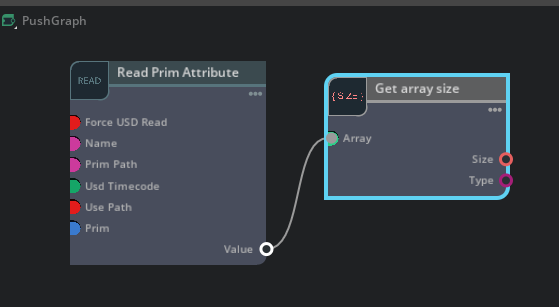
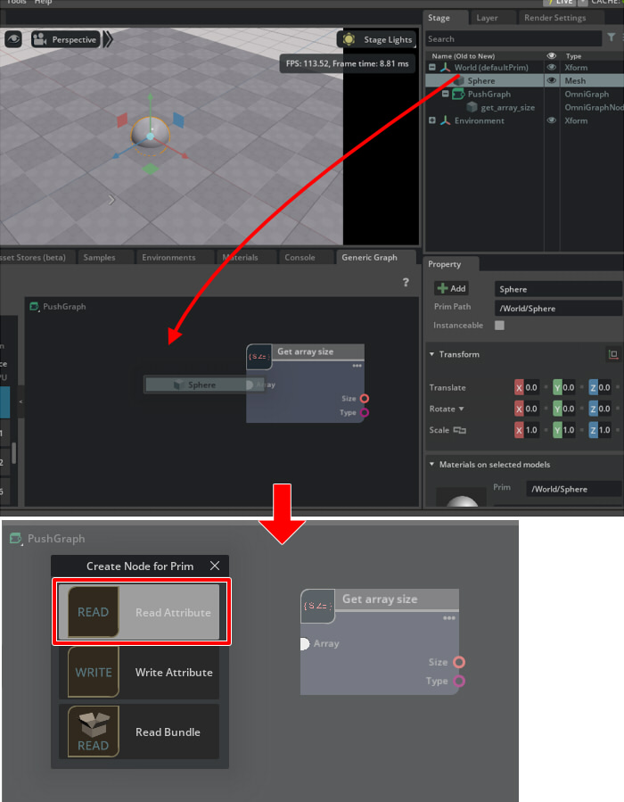
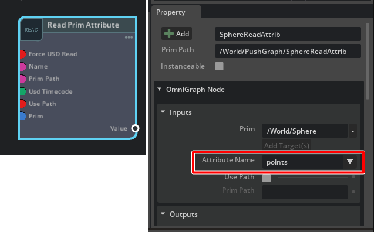
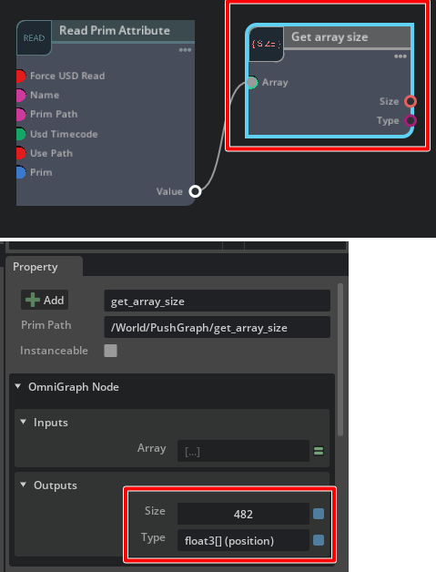

# 配列の取得

input要素として配列を使用します。     

"[ft_lab.OmniGraph.GetArraySize](../extensions/ft_lab.OmniGraph.GetArraySize)"は配列要素を入力し、そのサイズ（要素数）と型を返しています。      
このカスタムノードを元にして、配列を取得する実装を確認していきます。      

## GetArraySizeを確認

GetArraySizeノードの動きを確認します。    
Push Graphを使用しました。      

      
ここでは"Read Prim Attribute"からMeshの頂点座標配列の"points"を指定し、GetArraySizeノードのArrayにつないでいます。     

StageウィンドウでMeshを選択し、Graphにドロップします。       
READを選択して、Primの情報を読み取る"Read Prim Attribute"にします。      
      

"Read Prim Attribute"のPropertyで"Attribute Name"を"points"に変更します。    
これで、"Value"はfloat3の配列になります。      
      

"Read Prim Attribute"ノードの"Value"をGetArraySizeノードの"Array"につなぎます。      
      
GetArraySizeノードのPropertyのOutputsに要素数(Size)と型(Type)が表示されました。     

## [GetArraySize.ogn](../extensions/ft_lab.OmniGraph.GetArraySize/ft_lab/OmniGraph/GetArraySize/nodes/GetArraySize.ogn)

GetArraySizeノードの実装を見ていきます。     
"GetArraySize.ogn"は以下のように記載しました。      

```json
{
    "GetArraySize": {
        "version": 1,
        "categories": "examples",
        "description": "Get array size.",
        "language": "Python",
        "metadata": {
            "uiName": "Get Array Size"
        },
        "inputs": {
            "array": {
                "type": "arrays",
                "description": "Array",
                "metadata": {
                    "uiName": "Array"
                }
            }
        },
        "outputs": {
            "type": {
                "type": "string",
                "description": "Type",
                "metadata": {
                    "uiName": "Type"
                }
            },
            "size": {
                "type": "int",
                "description": "Number of array elements",
                "metadata": {
                    "uiName": "Size"
                }
            }
        }
    }
}
```

"inputs"の"array"は配列をつなぐ属性です。     
"type"で"arrays"を指定することで配列要素としています。     
この段階では、どのような型の配列かは分かりません（可変として受け取る）。      
```json
        "inputs": {
            "array": {
                "type": "arrays",
                "description": "Array",
                "metadata": {
                    "uiName": "Array"
                }
            }
        },

```

## [GetArraySize.py](../extensions/ft_lab.OmniGraph.GetArraySize/ft_lab/OmniGraph/GetArraySize/nodes/GetArraySize.py)

処理を行う"compute"は以下のように記載しました。     

```python
class GetArraySize:
    @staticmethod
    def compute(db) -> bool:
        try:
            db.outputs.type = db.inputs.array.type.get_type_name()
            db.outputs.size = db.inputs.array.size

        except TypeError as error:
            db.log_error(f"Processing failed : {error}")
            return False

        return True
```

"db.inputs.array.type"は、属性"array"の種類を取得します。      
"float3[] position"などが返ります（型 要素名）。     
get_type_name()で文字列(str)として取得します。     
この文字列を"db.outputs.type"(string)に渡しています。     

"db.inputs.array.size"は、属性"array"の要素数を取得します。     
この数値を"db.outputs.size"(int)に渡しています。     

なお、もう少し詳しく配列であるdb.inputs.arrayの情報を取得すると以下のようになりました。     

|指定|取得された値|説明|      
|---|---|---|      
|db.inputs.array.size|数値|配列の要素数|      
|db.inputs.array.type.get_type_name()|float3[] (position)|型 (要素名)|      
|db.inputs.array.type.get_base_type_name()|float|ベースの型名|      
|db.inputs.array.type.get_ogn_type_name()|pointf[3][]|OGNでの型名|      
|db.inputs.array.type.tuple_count|3|タプルの数|      

これらより、Meshのpointsはfloat x 3が配列を持つことを確認できます。     
USDでは"point3f[]"です。    

## [GetArraySizeDatabase.py](../extensions/ft_lab.OmniGraph.GetArraySize/ft_lab/OmniGraph/GetArraySize/ogn/GetArraySizeDatabase.py)

"GetArraySizeDatabase.py"では、INTERFACEは以下のように指定しています。      

```python
    INTERFACE = og.Database._get_interface([
        ('inputs:array', 'bool[],colord[3][],colord[4][],colorf[3][],colorf[4][],colorh[3][],colorh[4][],double[2][],double[3][],double[4][],double[],float[2][],float[3][],float[4][],float[],frame[4][],half[2][],half[3][],half[4][],half[],int64[],int[2][],int[3][],int[4][],int[],matrixd[3][],matrixd[4][],normald[3][],normalf[3][],normalh[3][],pointd[3][],pointf[3][],pointh[3][],quatd[4][],quatf[4][],quath[4][],texcoordd[2][],texcoordd[3][],texcoordf[2][],texcoordf[3][],texcoordh[2][],texcoordh[3][],timecode[],token[],transform[4][],uchar[],uint64[],uint[],vectord[3][],vectorf[3][],vectorh[3][]', 1, 'Array', 'The array', {}, True, None, False, ''),
        ('outputs:type', 'string', 0, 'Type', 'Array Type', {}, True, None, False, ''),
        ('outputs:size', 'int', 0, 'Size', 'Array Size', {}, True, None, False, ''),
    ])
```
'inputs:array'では、コンマ区切りで受け付ける配列要素を列挙しています。      

ValuesForInputsクラスでは、arrayは可変で受け取るため"og.RuntimeAttribute"を使用しました。     
これは定型的な書き方になるため、可変の場合はgetter/setterをコピー&ペーストでOKかと思います。     

```python
    class ValuesForInputs(og.DynamicAttributeAccess):
        LOCAL_PROPERTY_NAMES = {}
        """Helper class that creates natural hierarchical access to input attributes"""
        def __init__(self, node: og.Node, attributes, dynamic_attributes: og.DynamicAttributeInterface):
            """Initialize simplified access for the attribute data"""
            context = node.get_graph().get_default_graph_context()
            super().__init__(context, node, attributes, dynamic_attributes)
            self._batchedReadAttributes = []
            self._batchedReadValues = []

        @property
        def array(self) -> og.RuntimeAttribute:
            return og.RuntimeAttribute(self._attributes.array.get_attribute_data(), self._context, True)

        @array.setter
        def array(self, value_to_set: Any):
            """Assign another attribute's value to outputs.array"""
            if isinstance(value_to_set, og.RuntimeAttribute):
                self.array.value = value_to_set.value
            else:
                self.array.value = value_to_set

        def _prefetch(self):
            readAttributes = self._batchedReadAttributes
            newValues = _og._prefetch_input_attributes_data(readAttributes)
            if len(readAttributes) == len(newValues):
                self._batchedReadValues = newValues
```

可変については「[カスタムノードの型を可変にする](./NumericsNode.md)」もご参照くださいませ。     
これ以外は、カスタムノードの定型的な指定になるので説明は省きます。      


