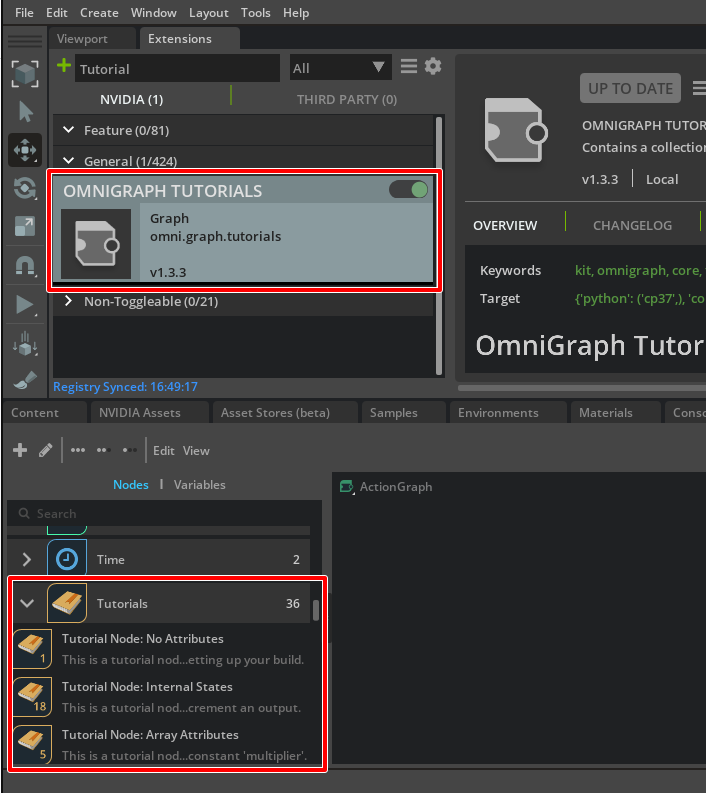

# Pythonでカスタムノードを作成

## 参考

参考 : https://docs.omniverse.nvidia.com/kit/docs/omni.graph.docs/latest/Overview.html

また、既存Extrensionの"omni.graph.tutorials"は様々なノードの作り方が書かれているため参考になりそうです。     

     
ドキュメントは以下。     

https://docs.omniverse.nvidia.com/kit/docs/omni.graph.docs/latest/tutorials/Overview.html      

ただし、サンプルではC++を使っているものも混在しています。     

## Pythonでカスタムノードを作成

OmniGraphのノード(OGN : OmniGraph Node)は、Pythonで作成することができます。     
提供はExtensionとして行います。     
これにより、特定作業のみに特化したノードを用意してノードを組み合わせて制御する、ということも可能になります。     
また、PythonでWARPを使用することでGPU(CUDA)を使った高速並列計算も可能となります。      

ノードの構成については「[ノードの構成](./NodeStructure.md)」をご参照くださいませ。    

ノードを新しく作成する手段として、以下を説明していきます。     

* ["Node Description Editor"を使用](./NodeDescriptionEditor.md)
* [Hello Worldとして"ft_lab.OmniGraph.simpleNode"を使用](./SimpleNode.md)
* [カスタムノードの型を可変にする](./NumericsNode.md)
* [配列の取得](./ArrayNode.md)
* [Primを取得し、USDから情報を取得](./UseUSDNode.md)

