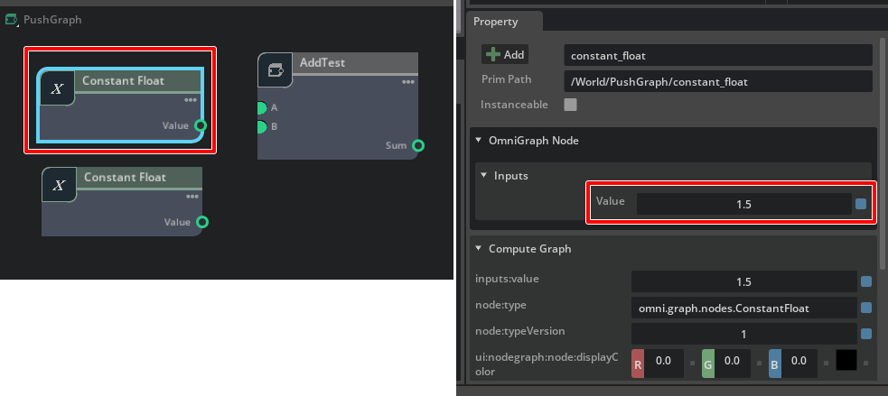

# Node Description Editor

参考 : https://docs.omniverse.nvidia.com/prod_extensions/prod_extensions/ext_omnigraph/tutorials/deforming_text_create_node.html

Omniverse Create 2022.3.3を使用しました。     
メインメニューの[Window]-[Visual Scripting]-[Node Description Editor]を選択します。      

"OmniGraph Node Description Editor"ウィンドウが表示されます。     
このツールにより、ノードの情報、Input/Outputを指定することで、Extensionとしてのノードのひな型を作成することができます。      

     

ノード情報を先に決めておきましょう。      

|名前|内容|    
|---|---|     
|Extension名|ft_lab.OmniGraph.NodeTest|     
|ノード名|AddTest|     
|Input : A|値A (float)|     
|Input : B|値B (float)|     
|Output : Sum|結果の加算値 (float)|     


## 使い方

単純なfloat値の足し算を行うノードを作ってみます。    
Inputとして2つのfloat、Outputとして1つのfloatを指定します。      

### Extension名の指定

"Extension Management"で"Extension Location"を確認。     
出力先のExtensionフォルダを指定します。      
デフォルトは"ドキュメントフォルダ/Kit/Shared/exts"となっています。      

"Extension Name"でExtension名を指定します。      
"会社名.ジャンル.プロジェクト名"みたいな感じに指定するのがよいと思います。      
     

### ノード情報を指定

     

"Name"にノード名を指定。これは、USDのPrim名の規則に従うようにしてください。     
文字列は半角英数字もしくはアンダーバーが使用できます。また、先頭は英字もしくはアンダーバーが使用できます。      

"Description"は説明文。     
"UI Name"はGraphで表示されるUI名を指定します。     

### Input情報を指定

"Input Attributes"の左下の四角をクリックすると、Input要素が追加表示されます。     
     

追加されたInputの左の四角をクリックすると削除になります。     

Input "A"は以下のように指定しました。     
     

|対象|値|説明|      
|---|---|---|      
|Name|A|名前|      
|Description|Value A|説明|      
|Base Type|float|型|      
|UI Name|A|UIでの表示名|      
|Default|0.0|初期値|      

"Input Attributes"の左下の四角をクリックし、Input "B"を追加します。     
Input "B"は以下のように指定しました。     
     

|対象|値|説明|      
|---|---|---|      
|Name|B|名前|      
|Description|Value B|説明|      
|Base Type|float|型|      
|UI Name|B|UIでの表示名|      
|Default|0.0|初期値|      

### Output情報を指定

"Output Attributes"の左下の四角をクリックし、Output "Sum"を追加します。     

Output "Sum"は以下のように指定しました。     
     

|対象|値|説明|      
|---|---|---|      
|Name|Sum|名前|      
|Description|Resulting additive value|説明|      
|Base Type|float|型|      
|UI Name|Sum|UIでの表示名|      
|Default|0.0|初期値|      

### ognの確認

一番下の"Raw .ogn Data"にノードの定義を行う拡張子ognファイルの内容が表示されます。      
ノード情報、Input、Outputの情報が反映されているのを確認します。     
     

### Extensionとして出力

     
"Populate Extension"ボタンを押します。     
これはノード情報がないExtensionを作成します。      
"Save"ボタンを押します。      
これにより、ノードの作成に必要なファイルを作成します。     
ファイルダイアログが表示されるため、ノード名と同じ"AddTest"としました。     
これは拡張子ognファイル名を指定します。

"generate Blank Implementation"ボタンを押します。     
これにより、ノード内で行うアルゴリズムを記載するテンプレート(Pythonファイル)を作成します。     

"Edit .ogn"ボタンを押します。      
テキストエディタ(VS Code)で"AddTest.ogn"が開きました。      
もし、変更がある場合は修正を行いファイル保存します。      

### ノード内で行うアルゴリズムを記載

"Edit Node"ボタンを押します。      
テキストエディタ(VS Code)で"AddTest.py"が開きました。      
ここでノード内で行う計算を記載します。      

開いた直後は以下のように記述されています。      
```python
"""
This is the implementation of the OGN node defined in AddTest.ogn
"""

# Array or tuple values are accessed as numpy arrays so you probably need this import
import numpy


class AddTest:
    """
         Add two floats
    """
    @staticmethod
    def compute(db) -> bool:
        """Compute the outputs from the current input"""

        try:
            # With the compute in a try block you can fail the compute by raising an exception
            pass
        except Exception as error:
            # If anything causes your compute to fail report the error and return False
            db.log_error(str(error))
            return False

        # Even if inputs were edge cases like empty arrays, correct outputs mean success
        return True
```

"def compute(db)"内のtryにて、処理を記載します。    
以下を追加しました。      

```python
        try:
            a = db.inputs.A
            b = db.inputs.B
            db.outputs.Sum = a + b
            
        except Exception as error:
            # If anything causes your compute to fail report the error and return False
            db.log_error(str(error))
            return False
```

"db.inputs"の要素として、Inputで指定した属性名を指定します。      
"db.outputs"の要素として、Outputで指定した属性名を指定します。      
ここでは加算するだけなので、以下の指定を行いました。     
```python
a = db.inputs.A
b = db.inputs.B
db.outputs.Sum = a + b
```

そのままファイル保存します。       
以上でExtensionとしてのノードができました。       

"OmniGraph Node Description Editor"ウィンドウは使わないため、閉じておきます。     

## 動作確認

### Extensionを確認

メインメニューの"Window"-"Extensions"を選択し、Extensionsウィンドウを表示。     
"THIRD PARTY"を選択すると、作成した"ft_lab.OmniGraph.NodeTest"を確認できます。     
また、すでに有効になっています。      
     

### Push Graphで確認してみる

Stageパネルで右クリックし、[Create]-[Visual Scripting]-[Push Graph]を選択し、Push Graphを作って動作確認してみます。     
Push Graphは、ノードを組み合わせたら即座に結果が反映されるGraphになります（何かイベントがあるたびに即座にノード全体が更新される）。       

Stageパネルでは"Push Graph"のPrimが追加されました。    
     
また、Contentsパネルにドッキングした形で"Generic Graph"が表示されます。      

Generic Graphの左端のNodesの一覧で、Genericのカテゴリを開いてスクロールして一番下に移動します。      
作成した"AddTest"があるのを確認できます。     
これを、Graphにドロップしました。      
     

"Constants"カテゴリから"Constant float"を探します。     
これを2つGraphにドロップしました。      
これは定数のfloatを与えるノードです。      
     


"Constant float"ノードを選択し、Propertyウィンドウで値を指定します。     
     
2つのノードに別々の値を入れました。      

"Constant float"ノードを、"AddTest"ノードのInputにつなぎます。     
     
Propertyウィンドウを見ると、"Sum"が2つのInputの加算値になっているのを確認できます。      

これで、カスタムのノードがPythonのExtensionとして作成できるのを確認できました。      
