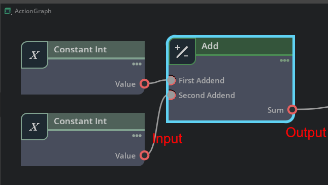

# ノードの構成

ノードは、入力(Input)と出力(Output)があります。      
これらは属性(Attribute)と呼ばれます。       
「入力値を元に処理を行い出力」という一連の流れを1つのノードが担当することになります。      
     
これらのノードを順番に組み合わせて流れを作るのがノードベースの制御の目的になります。     

## Input/Outputの型の種類

参考 : https://docs.omniverse.nvidia.com/kit/docs/omni.graph.docs/latest/dev/ogn/attribute_types.html

Input/Outputの型は以下のようなものがあります。      

|型名|Pythonでの型名|jsonでの型名|内容|     
|---|---|---|---|     
|bool|bool|bool|bool (True/False)|     
|double|float|float|64ビット浮動小数点|     
|float|float|float|32ビット浮動小数点|     
|half|float|float|16ビット浮動小数点|     
|int|int|integer|32ビット符号あり整数|     
|int64|int|integer|64ビット符号あり整数|     
|path|str|string|属性や他のノードのパス|     
|string|str|string|文字列|     
|token|str|string|トークン文字列|     
|uchar|int|integer|8ビット符号なし整数|     
|uint|int|integer|32ビット符号なし整数|     
|uint64|int|integer|64ビット符号なし整数|     

"jsonでの型名"はognファイルで指定する型名。     

### 配列型

|型名|Pythonでの型名|jsonでの型名|     
|---|---|---|     
|bool[\]|numpy.ndarray\[numpy.bool]|bool[]|     
|double[\]|numpy.ndarray\[numpy.float64]|float[]|     
|float[\]|numpy.ndarray\[numpy.float]|float[]|     
|half[\]|numpy.ndarray\[numpy.float16]|float[]|     
|int[\]|numpy.ndarray\[numpy.int32]|integer[]|     
|int64[\]|numpy.ndarray\[numpy.int32]|integer[]|     
|token[\]|numpy.ndarray\[numpy.str]|string[]|     
|uchar[\]|numpy.ndarray\[numpy.int32]|integer[]|     
|uint[\]|numpy.ndarray\[numpy.int32]|integer[]|     
|uint64[\]|numpy.ndarray\[numpy.int32]|integer[]|     

### タプル型

|型名|Pythonでの型名|jsonでの型名|     
|---|---|---|     
|double[2]|numpy.ndarray\[numpy.float64](2,)|[float, float]|     
|double[3]|numpy.ndarray\[numpy.float64](3,)|[float, float, float]|     
|double[4]|numpy.ndarray\[numpy.float64](4,)|[float, float, float, float]|     
|float[2]|numpy.ndarray\[numpy.float](2,)|[float, float]|     
|float[3]|numpy.ndarray\[numpy.float](3,)|[float, float, float]|     
|float[4]|numpy.ndarray\[numpy.float](4,)|[float, float, float, float]|     
|half[2]|numpy.ndarray\[numpy.float16](2,)|[float, float]|     
|half[3]|numpy.ndarray\[numpy.float16](3,)|[float, float, float]|     
|half[4]|numpy.ndarray\[numpy.float16](4,)|[float, float, float, float]|     
|int[2]|numpy.ndarray\[numpy.int32](2,)|[integer, integer]|     
|int[3]|numpy.ndarray\[numpy.int32](3,)|[integer, integer, integer]|     
|int[4]|numpy.ndarray\[numpy.int32](4,)|[integer, integer, integer, integer]|     

タプル型の配列も使用できます。      

### USDの型を持つもの

頂点座標値(pointf)や色(color3f)、ベクトル型(vector3f)、行列型(matrix4d)など。     

|型名|Python(USD)での型名|jsonでの型名|内容|     
|---|---|---|---|     
|colord[3]|Gf.Vec3d|colord[3]|色。 double x 3|     
|colorf[3]|Gf.Vec3f|colorf[3]|色。 float x 3|     
|colorh[3]|Gf.Vec3h|colorh[3]|色。 float16 x 3|     
|colord[4]|Gf.Vec4d|colord[4]|色。 double x 4|     
|colorf[4]|Gf.Vec4f|colorf[4]|色。 float x 4|     
|colorh[4]|Gf.Vec4h|colorh[4]|色。 float16 x 4|     
|normald[3]|Gf.Vec3d|normald[3]|法線ベクトル。 double x 3|     
|normalf[3]|Gf.Vec3f|normalf[3]|法線ベクトル。 float x 3|     
|normalh[3]|Gf.Vec3h|normalh[3]|法線ベクトル。 float16 x 3|     
|pointd[3]|Gf.Vec3d|pointd[3]|3D座標値。 double x 3|     
|pointf[3]|Gf.Vec3f|pointf[3]|3D座標値。 float x 3|     
|pointh[3]|Gf.Vec3h|pointh[3]|3D座標値。 float16 x 3|     
|quatd[4]|Gf.Quatd|quatd[4]|クォータニオン。 double x 4|     
|quatf[4]|Gf.Quatf|quatf[4]|クォータニオン。 float x 4|     
|quath[4]|Gf.Quath|quath[4]|クォータニオン。 float16 x 4|     
|texcoordd[2]|Gf.Vec2d|texcoordd[2]|UV値。 double x 2|     
|texcoordf[2]|Gf.Vec2f|texcoordf[2]|UV値。 float x 2|     
|texcoordh[2]|Gf.Vec2h|texcoordh[2]|UV値。 float16 x 2|     
|texcoordd[3]|Gf.Vec3d|texcoordd[3]|UVW値。 double x 3|     
|texcoordf[3]|Gf.Vec3f|texcoordf[3]|UVW値。 float x 3|     
|texcoordh[3]|Gf.Vec3h|texcoordh[3]|UVW値。 float16 x 3|     
|timecode|double|timecode|Timecode|     
|vectord[3]|Gf.Vec3d|vectord[3]|Vector3。 double x 3|     
|vectorf[3]|Gf.Vec3f|vectorf[3]|Vector3。 float x 3|     
|vectorh[3]|Gf.Vec3h|vectorh[3]|Vector3。 float16 x 3|     
|matrixd[2]|Gf.Matrix2d|matrixd[2]|2x2行列。 double x 2 x 2|     
|matrixd[3]|Gf.Matrix3d|matrixd[3]|3x3行列。 double x 3 x 3|     
|matrixd[4]|Gf.Matrix4d|matrixd[4]|4x4行列。 double x 4 x 4|     

