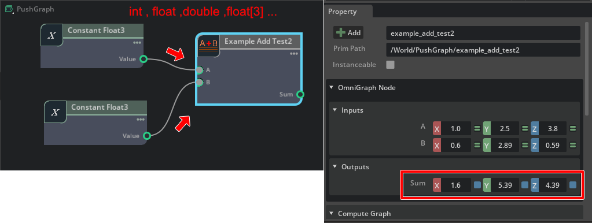
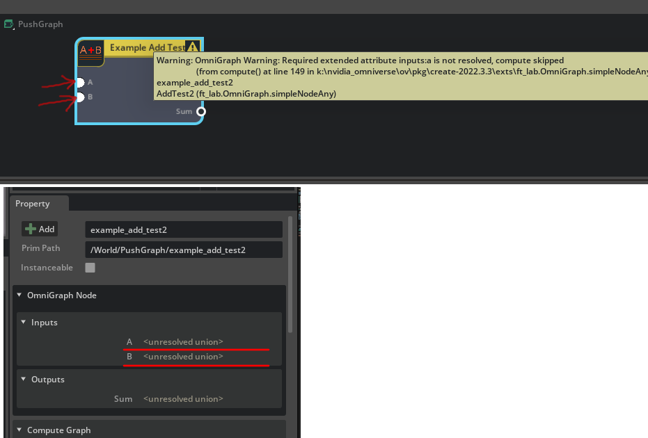
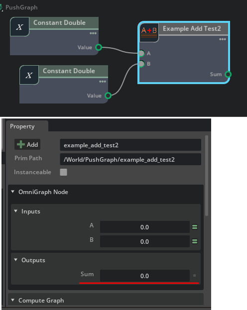

# ft_lab.Omni.Graph.simpleNodeAny

"[ft_lab.OmniGraph.simpleNode](../extensions/ft_lab.OmniGraph.simpleNode)"はfloat値の加算を行う単純なノードでした。      
"[ft_lab.OmniGraph.simpleNodeAny](../extensions/ft_lab.OmniGraph.simpleNodeAny)"は、少し拡張して入力値として複数の型を指定できるようにして加算を行うノードです。     
     
また、入力値により出力値の型も変更しています。     

変更が必要なpyファイルは以下の3つです。     

* nodes/AddTest2.ogn
* nodes/AddTest2.py
* ogn/AddTest2Database.py

## nodes/AddTest2.ogn

ognファイルは以下のように記載しました。     

```json
{
    "AddTest2": {
        "version": 1,
        "categories": "examples",
        "description": "Add node.",
        "language": "Python",
        "metadata": {
            "uiName": "Example Add Test"
        },
        "state": {
         "$comment": "The existence of this state section, even if it contains no attributes, means there is internal state that is entirely managed by the node"
        },
        "inputs": {
            "a": {
                "type": ["numerics"],
                "description": "a",
                "metadata": {
                    "uiName": "A"
                }
            },
            "b": {
                "type": ["numerics"],
                "description": "b",
                "metadata": {
                    "uiName": "B"
                }
            }
        },
        "outputs": {
            "sum": {
                "type": ["numerics"],
                "description": "sum",
                "metadata": {
                    "uiName": "Sum"
                }
            }
        }
    }
}
```

inputsおよびoutputsの"type"で以下のような指定を行っています。     
```json
"type": ["numerics"],
```
これにより、入力値は数値型の任意の型を指定できるようになります。     
float, double, int, float[2], float[3]など。      
それぞれのコード(AddTest2.py, AddTest2Database.py)でこのための追加/修正が必要になります。     

## nodes/AddTest2.py

"compute(db)"でノードで行う処理（ここでは加算）を行います。    
"on_connection_type_resolve(node)"で入力値の型を元に、出力値の型を決定します。    
これは、ノードで入力値が接続された後に呼ばれることになります。      
順番は"on_connection_type_resolve(node)"が呼ばれて出力値の型が確定された後に、"compute(db)"が呼ばれます。     

```python
import numpy as np
import omni.graph.core as og
import omni.ext
import math

class AddTest2:

    # ---------------------------------------------------.
    # Compute the outputs from the current input.
    # ---------------------------------------------------.
    @staticmethod
    def compute(db) -> bool:
        try:
            # Attribute Type for ["numerics"].
            # "aType.base_type" is the following value.
            # og.BaseDataType.INT, og.BaseDataType.INT64, og.BaseDataType.FLOAT, og.BaseDataType.DOUBLE, etc.
            aType = db.inputs.a.type
            bType = db.inputs.b.type
            sumType = db.outputs.sum.type

            # The actual value is "a.value".
            a = db.inputs.a
            b = db.inputs.b

            db.outputs.sum.value = a.value + b.value

        except TypeError as error:
            db.log_error(f"Processing failed : {error}")
            return False

        return True

    # ---------------------------------------------------.
    # Resolves the type of the output based on the types of inputs.
    # This is called after the inputs connection is finalized.
    # ---------------------------------------------------.
    @staticmethod
    def on_connection_type_resolve(node) -> None:
        # Attribute Type for ["numerics"].
        # "aType.base_type" is the following value.
        # og.BaseDataType.INT, og.BaseDataType.INT64, og.BaseDataType.FLOAT, og.BaseDataType.DOUBLE, etc.
        aType = node.get_attribute("inputs:a").get_resolved_type()
        bType = node.get_attribute("inputs:b").get_resolved_type()
        sumType = node.get_attribute("outputs:sum").get_resolved_type()

        # If the type of "outputs:sum" is not specified.
        if (
            aType.base_type != og.BaseDataType.UNKNOWN
            and bType.base_type != og.BaseDataType.UNKNOWN
            and sumType.base_type == og.BaseDataType.UNKNOWN
        ):
            
            # Set the type of "outputs:sum" to the same as "inputs:a".
            og.resolve_fully_coupled(
                [node.get_attribute("inputs:a"), node.get_attribute("outputs:sum")]
            )
```

### on_connection_type_resolve(node)

```python
aType = node.get_attribute("inputs:a").get_resolved_type()
```
は、指定の入力や出力に対する型を取得します。      
"aType.base_type"は以下のような値が返されます。     

※ "og"は"import omni.graph.core as og"      

|型名|説明|     
|---|---|     
|og.BaseDataType.UNKNOWN|不明|     
|og.BaseDataType.BOOL|bool|     
|og.BaseDataType.UCHAR|符号なしのchar (1バイト分)|     
|og.BaseDataType.INT|符号ありのint|     
|og.BaseDataType.UINT|符号なしのint|     
|og.BaseDataType.INT64|符号ありのint64|     
|og.BaseDataType.UINT64|符号なしのint64|     
|og.BaseDataType.FLOAT|float|     
|og.BaseDataType.DOUBLE|double|     
|og.BaseDataType.TOKEN|token（識別名などの文字列）|     
|og.BaseDataType.ASSET|Asset（ファイルパスなど）|     
|og.BaseDataType.PRIM|USDのPrim|     

なお、ここではタプルや配列の情報は含みません。      

参考 : https://docs.omniverse.nvidia.com/kit/docs/omni.graph.docs/latest/dev/ogn/ogn_code_samples_python.html#extended-python-attribute-data-type-any     

### og.resolve_fully_coupled

```python
if (
    aType.base_type != og.BaseDataType.UNKNOWN
    and bType.base_type != og.BaseDataType.UNKNOWN
    and sumType.base_type == og.BaseDataType.UNKNOWN
):
```
にて、入力値が2つとも指定され、出力値の型が不明な場合に出力値の型を決定する処理を入れています。     

以下で、"inputs:a"で指定された型を"outputs:sum"に与えています。     
```python
    og.resolve_fully_coupled(
        [node.get_attribute("inputs:a"), node.get_attribute("outputs:sum")]
    )
```
これにより、"outputs:sum"の型が決定されました。     
この型の解決を行うために呼ばれるのが"on_connection_type_resolve(node)"ということになりそうです。     

### compute(db)

compute(db)では以下のように記載しています。      


```python
@staticmethod
def compute(db) -> bool:
    try:
        # Attribute Type for ["numerics"].
        # "aType.base_type" is the following value.
        # og.BaseDataType.INT, og.BaseDataType.INT64, og.BaseDataType.FLOAT, og.BaseDataType.DOUBLE, etc.
        aType = db.inputs.a.type
        bType = db.inputs.b.type
        sumType = db.outputs.sum.type

        # The actual value is "a.value".
        a = db.inputs.a
        b = db.inputs.b

        db.outputs.sum.value = a.value + b.value

    except TypeError as error:
        db.log_error(f"Processing failed : {error}")
        return False

    return True
```

以下のように例外処理で保護しています。     

```python
try:
    # 何か処理
    except TypeError as error:
        # 例外処理
```

"db.inputs.属性名"で入力を取得、"db.outputs.属性名"で出力を取得。     
"db.inputs.属性名.type"とすると、そのときの属性の型を取得します。     
"db.inputs.属性名.type.base_type"は、"og.BaseDataType.INT", "og.BaseDataType.DOUBLE"などを返します。     
型によって計算を変える場合は、この情報を使用して分岐することになります。      

入力や出力の型が固定されていない("numerics")場合、"db.inputs.a"は直接の値ではない点に注意してください。      
"db.inputs.a.value"が値になります。    

```python
    a = db.inputs.a
    b = db.inputs.b

    db.outputs.sum.value = a.value + b.value
```
で加算を行い、"db.outputs.sum.value"に結果を格納しています。      
なお、この加算処理はa,b共に別の型の場合でも（例えば aがfloat3、bがfloat）自動で計算されます。     
     

"nodes/AddTest2.py"では、出力時の型の決定とノードでの処理を記載しました。     


## ogn/AddTest2Database.py

"ogn/AddTest2Database.py"は変更点が多いです。     


```python
    INTERFACE = og.Database._get_interface([
        ('inputs:a', 'int,int64,half,float,double,double[2],double[3],float[2],float[3]', 1, 'A', 'value a.', {}, True, None, False, ''),
        ('inputs:b', 'int,int64,half,float,double,double[2],double[3],float[2],float[3]', 1, 'B', 'value b.', {}, True, None, False, ''),
        ('outputs:sum', 'int,int64,half,float,double,double[2],double[3],float[2],float[3]', 1, 'Sum', 'output sum', {}, True, None, False, ''),
    ])
```
入力と出力の情報は順番に、以下の内容になります。      

* 名前
* 型 (複数を許可する場合は、コンマで区切って指定)
* 型のインデックス ?
* UIでの表示名
* 説明
* メタデータ
* 必要かどうか (True, False)
* デフォルト値
* 非推奨 (True, False)
* 非推奨時のメッセージ

これは、omni.graph.tutorialsのコードのコメントから参照しました。     
ここでは、許可する型とそのインデックス（1を指定する必要がある？0だとエラーになりました）に注目します。     

```python
'int,int64,half,float,double,double[2],double[3],float[2],float[3]'
```
として、許可する型を列挙しています。     

### ValuesForInputs

"\_\_init\_\_"はほぼ変更なしですが、"self._batchedReadValues"には初期値を入れていません（初期化時は型がまだ定まってないため）。      

```python
    class ValuesForInputs(og.DynamicAttributeAccess):
        LOCAL_PROPERTY_NAMES = {"a", "b"}
        """Helper class that creates natural hierarchical access to input attributes"""
        def __init__(self, node: og.Node, attributes, dynamic_attributes: og.DynamicAttributeInterface):
            """Initialize simplified access for the attribute data"""
            context = node.get_graph().get_default_graph_context()
            super().__init__(context, node, attributes, dynamic_attributes)
            self._batchedReadAttributes = [self._attributes.a, self._attributes.b]
            self._batchedReadValues = []
```

getterとsetterは大きく変わります。    

"[ft_lab.OmniGraph.simpleNode](../extensions/ft_lab.OmniGraph.simpleNode)"では以下のように指定していました。     

```python
        @property
        def a(self):
            return self._batchedReadValues[0]

        @a.setter
        def a(self, value):
            self._batchedReadValues[0] = value
```

"ft_lab.OmniGraph.simpleNodeAny"では、    
getterは"og.RuntimeAttribute"を返す書き方に変わります。     

```python
        @property
        def a(self) -> og.RuntimeAttribute:
            return og.RuntimeAttribute(self._attributes.a.get_attribute_data(), self._context, True)
```

setterは"value_to_set: Any"を指定しており、これは型が可変になる指定になります。     

```python
        @a.setter
        def a(self, value_to_set: Any):
            """Assign another attribute's value to outputs.a"""
            if isinstance(value_to_set, og.RuntimeAttribute):
                self.a.value = value_to_set.value
            else:
                self.a.value = value_to_set
```

入力値の"b"のgetter/setterも同様に指定。     
```python
        @property
        def b(self) -> og.RuntimeAttribute:
            return og.RuntimeAttribute(self._attributes.b.get_attribute_data(), self._context, True)

        @b.setter
        def b(self, value_to_set: Any):
            """Assign another attribute's value to outputs.a"""
            if isinstance(value_to_set, og.RuntimeAttribute):
                self.b.value = value_to_set.value
            else:
                self.b.value = value_to_set
```

また"ft_lab.OmniGraph.simpleNode"で指定していた、"\_\_getattr\_\_" "\_\_setattr\_\_"は存在しません。     

### ValuesForOutputs

ValuesForOutputsの"\_\_init\_\_"は変更なし。     

```python
    class ValuesForOutputs(og.DynamicAttributeAccess):
        LOCAL_PROPERTY_NAMES = { "sum" }
        """Helper class that creates natural hierarchical access to output attributes"""
        def __init__(self, node: og.Node, attributes, dynamic_attributes: og.DynamicAttributeInterface):
            """Initialize simplified access for the attribute data"""
            context = node.get_graph().get_default_graph_context()
            super().__init__(context, node, attributes, dynamic_attributes)
            self._batchedWriteValues = { }
```

getterとsetterは入力のときと同じで、大きく変わります。    
指定方法は入力の時と同じように"og.RuntimeAttribute"を使用しています。     

```python
        @property
        def sum(self) -> og.RuntimeAttribute:
            """Get the runtime wrapper class for the attribute outputs.product"""
            return og.RuntimeAttribute(self._attributes.sum.get_attribute_data(), self._context, False)

        @sum.setter
        def product(self, value_to_set: Any):
            """Assign another attribute's value to outputs.product"""
            if isinstance(value_to_set, og.RuntimeAttribute):
                self.sum.value = value_to_set.value
            else:
                self.sum.value = value_to_set
```
また"ft_lab.OmniGraph.simpleNode"で指定していた、"\_\_getattr\_\_" "\_\_setattr\_\_"は存在しません。     

### ValuesForState

これは"ft_lab.OmniGraph.simpleNode"の時と同じで変更なし。     

### ABI : get_node_type

ABIインターフェースの指定は、いくつかの変更が必要です。     

get_node_type()はそのままの構造。return値のみノード名に合わせて変更します。      

```python
    class abi:
        @staticmethod
        def get_node_type():
            get_node_type_function = getattr(AddTest2Database.NODE_TYPE_CLASS, 'get_node_type', None)
            if callable(get_node_type_function):
                return get_node_type_function()
            return 'ft_lab.OmniGraph.simpleNodeAny.AddTest2'
```

### ABI : compute

実際の処理を行う部分で、入力と出力の型のチェックを行うようにしました。     

```python
        @staticmethod
        def compute(context, node):
            try:
                per_node_data = AddTest2Database.PER_NODE_DATA[node.node_id()]
                db = per_node_data.get('_db')
                if db is None:
                    db = AddTest2Database(node)
                    per_node_data['_db'] = db
            except:
                db = AddTest2Database(node)

            try:
                # Displays a message prompting the user to connect a node.
                if db.inputs.a.type.base_type == og.BaseDataType.UNKNOWN:
                    db.log_warning('Required extended attribute inputs:a is not resolved, compute skipped')
                    return False

                if db.inputs.b.type.base_type == og.BaseDataType.UNKNOWN:
                    db.log_warning('Required extended attribute inputs:b is not resolved, compute skipped')
                    return False

                if db.outputs.sum.type.base_type == og.BaseDataType.UNKNOWN:
                    db.log_warning('Required extended attribute outputs:sum is not resolved, compute skipped')
                    return False

                compute_function = getattr(AddTest2Database.NODE_TYPE_CLASS, 'compute', None)
                if callable(compute_function) and compute_function.__code__.co_argcount > 1:
                    return compute_function(context, node)

                db.inputs._prefetch()
                db.inputs._setting_locked = True
                with og.in_compute():
                    return AddTest2Database.NODE_TYPE_CLASS.compute(db)
            except Exception as error:
                stack_trace = "".join(traceback.format_tb(sys.exc_info()[2].tb_next))
                db.log_error(f'Assertion raised in compute - {error}\n{stack_trace}', add_context=False)
            finally:
                db.inputs._setting_locked = False
                db.outputs._commit()
            return False
```

dbの取得部は変化なし。     
その次に、以下の記述を行っています。     

```python
    if db.inputs.a.type.base_type == og.BaseDataType.UNKNOWN:
        db.log_warning('Required extended attribute inputs:a is not resolved, compute skipped')
        return False
```
これは、入力の"a"が接続されていない場合に、メッセージを表示する処理です。     
入力値がない場合は、以下のように警告(warning)が表示されます。     
     
これは、入力を促すことにつながります。     

入力値が接続されると、"nodes/AddTest2.py"の"on_connection_type_resolve(node)"が呼ばれて、出力値の型が解決されることになります。     
     

これにより、以下の"db.outputs.sum.type.base_type"の判定も通過することになります。     

```python
    if db.outputs.sum.type.base_type == og.BaseDataType.UNKNOWN:
        db.log_warning('Required extended attribute outputs:sum is not resolved, compute skipped')
        return False
```

この後の流れは変更なしです。    
computeではノードの処理が呼ばれます。     

その後の処理は"ft_lab.OmniGraph.simpleNode"から変更なしです。     
"initialize_type"でノードのExtension名や名前、カテゴリ、説明、アイコンなどを指定しています。      

```python
        @staticmethod
        def initialize_type(node_type):
            initialize_type_function = getattr(AddTest2Database.NODE_TYPE_CLASS, 'initialize_type', None)
            needs_initializing = True
            if callable(initialize_type_function):
                needs_initializing = initialize_type_function(node_type)
            if needs_initializing:
                node_type.set_metadata(ogn.MetadataKeys.EXTENSION, "ft_lab.OmniGraph.simpleNodeAny")
                node_type.set_metadata(ogn.MetadataKeys.UI_NAME, "Example Add Test2")
                node_type.set_metadata(ogn.MetadataKeys.CATEGORIES, "examples")
                node_type.set_metadata(ogn.MetadataKeys.DESCRIPTION, "Test to add two float values")
                node_type.set_metadata(ogn.MetadataKeys.LANGUAGE, "Python")

                # Set Icon(svg).
                icon_path = carb.tokens.get_tokens_interface().resolve("${ft_lab.OmniGraph.simpleNodeAny}")
                icon_path = icon_path + '/' + "data/icons/icon.svg"
                node_type.set_metadata(ogn.MetadataKeys.ICON_PATH, icon_path)

                AddTest2Database.INTERFACE.add_to_node_type(node_type)

```

"ft_lab.OmniGraph.simpleNode"と"ft_lab.OmniGraph.simpleNodeAny"の2つのノード(Extensionとして提供)を見ると、大部分は同じであるのが分かりました。     
ですので、カスタムノードを用意する場合はテンプレートを用意してそれを書き換えて扱うのが早い、というのが見えてきそうです。     
余裕があればラッパーを作ってもいいのかもしれません。      


