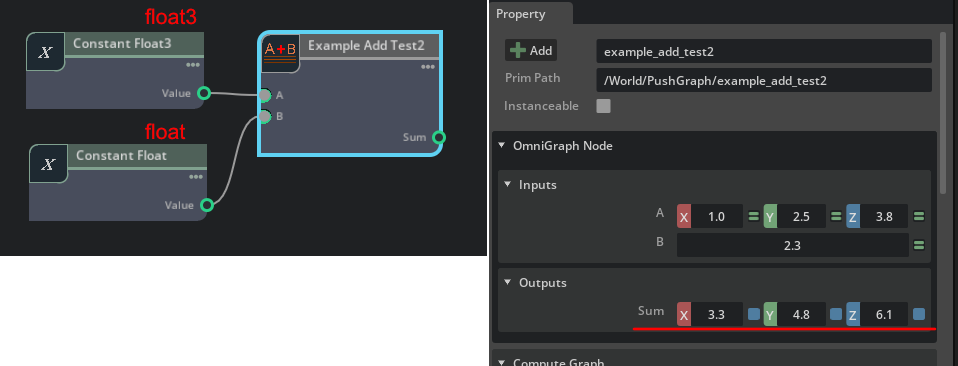

# ft_lab.Omni.Graph.simpleNodeAny

"[ft_lab.OmniGraph.simpleNode](../extensions/ft_lab.OmniGraph.simpleNode)"はfloat値の加算を行う単純なノードでした。      
"[ft_lab.OmniGraph.simpleNodeAny](../extensions/ft_lab.OmniGraph.simpleNodeAny)"は、少し拡張して入力値として複数の種類を選択し加算を行うノードです。     
     
また、入力値により出力値の型も変更しています。     

変更が必要なpyファイルは以下の3つです。     

* nodes/AddTest2.ogn
* nodes/AddTest2.py
* ogn/AddTest2Database.py

## nodes/AddTest2.ogn

ognファイルは以下のように記載しました。     

```json
{
    "AddTest2": {
        "version": 1,
        "categories": "examples",
        "description": "Add node.",
        "language": "Python",
        "metadata": {
            "uiName": "Example Add Test"
        },
        "state": {
         "$comment": "The existence of this state section, even if it contains no attributes, means there is internal state that is entirely managed by the node"
        },
        "inputs": {
            "a": {
                "type": ["numerics"],
                "description": "a",
                "metadata": {
                    "uiName": "A"
                }
            },
            "b": {
                "type": ["numerics"],
                "description": "b",
                "metadata": {
                    "uiName": "B"
                }
            }
        },
        "outputs": {
            "sum": {
                "type": ["numerics"],
                "description": "sum",
                "metadata": {
                    "uiName": "Sum"
                }
            }
        }
    }
}
```

inputsおよびoutputsの"type"で以下のような指定を行っています。     
```json
"type": ["numerics"],
```
これにより、入力値は数値型の任意の値を指定できるようになります。     
float, double, int, float[2], float[3]など。      
それぞれのコード(AddTest2.py, AddTest2Database.py)でこのための追加/修正が必要になります。     

## nodes/AddTest2.py

"compute(db)"でノードで行う処理（ここでは加算）を行います。    
"on_connection_type_resolve(node)"で入力値の型を元に、出力値の型を決定します。    
これは、ノードで入力値が接続された後に呼ばれることになります。      
順番は"on_connection_type_resolve(node)"が呼ばれて出力値の型が確定された後に、"compute(db)"が呼ばれます。     

```python
import numpy as np
import omni.graph.core as og
import omni.ext
import math

class AddTest2:

    # ---------------------------------------------------.
    # Compute the outputs from the current input.
    # ---------------------------------------------------.
    @staticmethod
    def compute(db) -> bool:
        try:
            # Attribute Type for ["numerics"].
            # "aType.base_type" is the following value.
            # og.BaseDataType.INT, og.BaseDataType.INT64, og.BaseDataType.FLOAT, og.BaseDataType.DOUBLE, etc.
            aType = db.inputs.a.type
            bType = db.inputs.b.type
            sumType = db.outputs.sum.type

            # The actual value is "a.value".
            a = db.inputs.a
            b = db.inputs.b

            db.outputs.sum.value = a.value + b.value

        except TypeError as error:
            db.log_error(f"Processing failed : {error}")
            return False

        return True

    # ---------------------------------------------------.
    # Resolves the type of the output based on the types of inputs.
    # This is called after the inputs connection is finalized.
    # ---------------------------------------------------.
    @staticmethod
    def on_connection_type_resolve(node) -> None:
        # Attribute Type for ["numerics"].
        # "aType.base_type" is the following value.
        # og.BaseDataType.INT, og.BaseDataType.INT64, og.BaseDataType.FLOAT, og.BaseDataType.DOUBLE, etc.
        aType = node.get_attribute("inputs:a").get_resolved_type()
        bType = node.get_attribute("inputs:b").get_resolved_type()
        sumType = node.get_attribute("outputs:sum").get_resolved_type()

        # If the type of "outputs:sum" is not specified.
        if (
            aType.base_type != og.BaseDataType.UNKNOWN
            and bType.base_type != og.BaseDataType.UNKNOWN
            and sumType.base_type == og.BaseDataType.UNKNOWN
        ):
            
            # Set the type of "outputs:sum" to the same as "inputs:a".
            og.resolve_fully_coupled(
                [node.get_attribute("inputs:a"), node.get_attribute("outputs:sum")]
            )
```

### on_connection_type_resolve(node)

```python
aType = node.get_attribute("inputs:a").get_resolved_type()
```
は、指定の入力や出力に対する型を取得します。      
"aType.base_type"は以下のような値が返されます。     

※ "og"は"import omni.graph.core as og"      

|型名|説明|     
|---|---|     
|og.BaseDataType.UNKNOWN|不明|     
|og.BaseDataType.BOOL|bool|     
|og.BaseDataType.UCHAR|符号なしのchar (1バイト分)|     
|og.BaseDataType.INT|符号ありのint|     
|og.BaseDataType.UINT|符号なしのint|     
|og.BaseDataType.INT64|符号ありのint64|     
|og.BaseDataType.UINT64|符号なしのint64|     
|og.BaseDataType.FLOAT|float|     
|og.BaseDataType.DOUBLE|double|     
|og.BaseDataType.TOKEN|token（識別名などの文字列）|     
|og.BaseDataType.ASSET|Asset（ファイルパスなど）|     
|og.BaseDataType.PRIM|USDのPrim|     

なお、ここではタプルや配列の情報は含みません。      

参考 : https://docs.omniverse.nvidia.com/kit/docs/omni.graph.docs/latest/dev/ogn/ogn_code_samples_python.html#extended-python-attribute-data-type-any     

### og.resolve_fully_coupled

```python
if (
    aType.base_type != og.BaseDataType.UNKNOWN
    and bType.base_type != og.BaseDataType.UNKNOWN
    and sumType.base_type == og.BaseDataType.UNKNOWN
):
```
にて、入力値が2つとも指定され、出力値の型が不明な場合に出力値の型を決定する処理を入れています。     

以下で、"inputs:a"で指定された型を"outputs:sum"に与えています。     
```python
    og.resolve_fully_coupled(
        [node.get_attribute("inputs:a"), node.get_attribute("outputs:sum")]
    )
```
これにより、"outputs:sum"の型が決定されました。     
この型の解決を行うために呼ばれるのが"on_connection_type_resolve(node)"ということになりそうです。     

### compute(db)

compute(db)では以下のように記載しています。      


```python
@staticmethod
def compute(db) -> bool:
    try:
        # Attribute Type for ["numerics"].
        # "aType.base_type" is the following value.
        # og.BaseDataType.INT, og.BaseDataType.INT64, og.BaseDataType.FLOAT, og.BaseDataType.DOUBLE, etc.
        aType = db.inputs.a.type
        bType = db.inputs.b.type
        sumType = db.outputs.sum.type

        # The actual value is "a.value".
        a = db.inputs.a
        b = db.inputs.b

        db.outputs.sum.value = a.value + b.value

    except TypeError as error:
        db.log_error(f"Processing failed : {error}")
        return False

    return True
```

以下のように例外処理で保護しています。     

```python
try:
    # 何か処理
    except TypeError as error:
        # 例外処理
```

"db.inputs.属性名"で入力を取得、"db.outputs.属性名"で出力を取得。     
"db.inputs.属性名.type"とすると、そのときの属性の型を取得します。     
型によって計算を変える場合は、この情報を使用して分岐することになります。      

入力や出力の型が固定されていない("numerics")場合、"db.inputs.a"は直接の値ではない点に注意してください。      
"db.inputs.a.value"が値になります。    

```python
    a = db.inputs.a
    b = db.inputs.b

    db.outputs.sum.value = a.value + b.value
```
で加算を行い、"db.outputs.sum.value"に結果を格納しています。      
なお、この加算処理はa,b共に同一の型の場合でも、aがfloat3、bがfloatの場合でも自動で計算されます。     
     

"nodes/AddTest2.py"では、出力時の型の決定とノードでの処理を記載しました。     


## ogn/AddTest2Database.py

"ogn/AddTest2Database.py"は変更点が多いです。     


