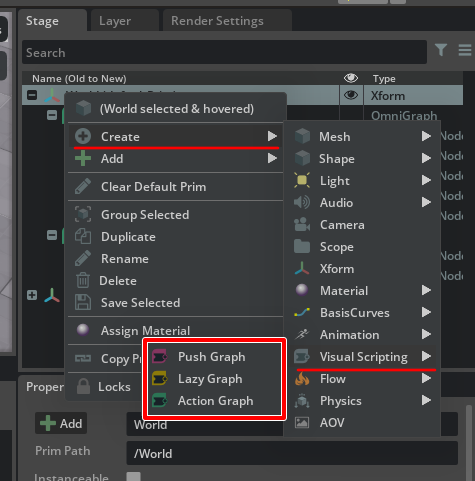

# OmniGraphとAction Graphの違いは ?

参考 : https://docs.omniverse.nvidia.com/kit/docs/omni.graph.docs/latest/Glossary.html#term-Action-Graph

"An Action Graph is an OmniGraph that triggers actions in response to a particular event."     

訳すると"Action Graphは、特定のイベントに反応してアクションを起こすOmniGraph"、となります。     
OmniGraphは、よりベース寄りのくくりとなりそうです。     

"なんとかGraph"と呼ばれるものは以下のようなものがあります。      
https://docs.omniverse.nvidia.com/kit/docs/omni.graph.docs/latest/Glossary.html      
の説明を参考にしました。    

|Graph名|内容|      
|---|---|      
|Action Graph|イベント（キーボード、形状の選択、アニメーション再生、Physicsの衝突など）でのアクション。 更新イベント(Tickなど)を呼ぶことで処理が実行される。|      
|Push Graph|システムの更新ごとに実行される。 何かアクションがあれば自動で実行されると考えるとよさそう。 使い勝手はよいが、効率はよくない。|      
|Lazy Graph|(まだ未調査)|      

これらはStageパネルで右クリックし、[Create] - [Visual Scripting]からGraphのPrimを追加できます。      
     

前述のものとは少し違いますが、これ以外にMDL Graphというものもあります。     

|Graph名|内容|      
|---|---|      
|MDL Graph (Material Graph)|マテリアルのMDLをノードベースで構築|      

