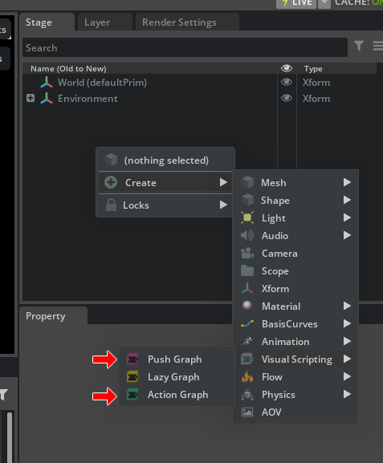

# Push GraphとAction Graphでのイベントの扱いの違い

Stageパネルを右クリックし、[Create]-[Visual Scripting]より「Push Graph」と「Action Graph」を指定できます。     
      
これらは、イベント処理の扱い方が違います。      
それぞれについて比較を行いました。     

## Push Graph

参考 : https://docs.omniverse.nvidia.com/kit/docs/omni.graph.docs/latest/Glossary.html#term-Push-Graph      

    A Push Graph is an OmniGraph that evaluates every node at every system update, or “tick”.
    It is convenient to use, but inefficient.

Push Graphは、システムの更新（tick）ごとにすべてのノードを評価するOmniGraphです。      
使い勝手はよいですが効率はよくありません。      

## Action Graph

参考 : https://docs.omniverse.nvidia.com/kit/docs/omni.graph.docs/latest/Glossary.html#term-Action-Graph     

    An Action Graph is an OmniGraph that triggers actions in response to a particular event.

Action Graphは、特定のイベントに反応してアクションを起こすOmniGraphです。      

## 加算処理を確認

たとえば、単純な加算処理を行います。     

### Push Graphの場合

まずはPush Graphを確認します。      
Math-Add ノードを配置。     
      

Constants-Constant Float ノードを配置。     
また、Propertyウィンドウで値を指定します。     
      
Addノードにこの2つのfloat値を接続すると、AddのPropertyでは即座にOutputsのSumに合計値が反映されました。     
      
このように、Push Graphは「即時更新」が行われます。      

### Action Graphの場合

Action Graphで同様の処理を行います。     
      
これだけでは更新が行われないため、AddノードのOutputsのSumは0.0のままです。     

更新を促すのは、例えば以下のような処理を行います。     
Debug-Print Textノードを配置。    
Propertyウィンドウで「To Screen」をOnにします。     
ここでは、Viewportに加算結果を出すとしました。      
      

Event-OnTickノードを追加し、OnTickノードの"Tick"をPrint Textノードの"In"に接続します。      
      

AddTextノードの"Sum"はfloat値であるため、これをstringに変換します。     
Function-To Stringノードを配置。     
      
AddTextノードの"Sum"をTo Stringノードの"value"に接続。      
To Stringノードの"String"をPrint Textノードの"Text"に接続。      
      

Playすると、Addノードでの合計値がViewportの左上に表示されました。      
      

この段階で、ようやくAddノードのPropertyの"Sum"に合計値が入るのを確認できました。      
      

このときのアクションのトリガーは"Tick"によって行われ、これはPlay中の更新処理（フレームごとの更新）で呼ばれることになります。      

Action Graphは回りくどく見えますが、「イベントの駆動を独自に制御できる」という利点があります。     
ここではTickを使いましたが、Playの開始や終了時に処理を呼んだり、カスタムイベントを呼ぶこともできます。      
もっとノードが増えた場合、その都度全体が更新されると負荷が高くなるのも分かるかと思います。      

制御ではAction Graphを使うほうが実用性があるとは思いますが、ちょっとした確認の場合はPush Graphを使うほうが手軽ではあります。     
