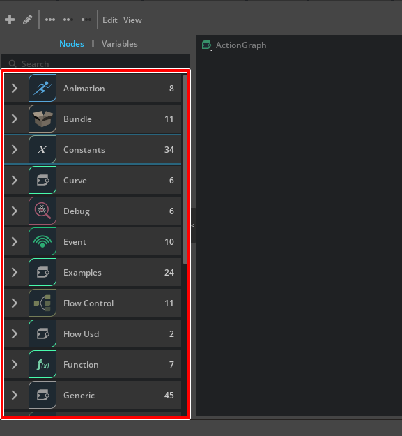

# ft_lab.Omni.Graph.simpleNode

"[ft_lab.OmniGraph.simpleNode](../extensions/ft_lab.OmniGraph.simpleNode)"は、単純なfloat値の加算を行うHelloWorld的なノードです。     
これを例として、PythonでのOmniGraphはどのような組み方をすればよいのか確認していきます。       
「[Node Description Editor](./NodeDescriptionEditor.md)」を使って作成したOmniGraph用のExtensionもほぼ同じなため、応用が利く内容になります。     

## ディレクトリ構成

```
[ft_lab.OmniGraph.simpleNode]
    [config]
        extension.toml

    [data]
        [icons]
            icon.svg  ... Node Icon.
        icon.png      ... Icon file (256 x 256 pixel).
        preview.png

    [docs]
        CHANGELOG.md
        index.rst
        README.md

    [ft_lab]
        [OmniGraph]
            [simpleNode]
                [nodes]
                    AddTest.ogn
                    AddTest.py
                [ogn]
                    __init__.py
                    AddTestDatabase.py
                __init__.py
                extension.py
```

通常のExtensionと違うところは、以下があります。     

* "config/extension.toml"ファイルへの情報追加      
* "data/icons/icon.svg" Graphで使用するアイコン
* "nodes/AddTest.ogn", "nodes/AddTest.py"の追加
* "ogn/AddTestDatabase.py"の追加

## config/extension.toml

"config/extension.toml"は以下のように記載しています。     

```toml
[package]
# Semantic Versionning is used: https://semver.org/
version = "0.0.1"

# Lists people or organizations that are considered the "authors" of the package.
authors = ["ft-lab"]

# The title and description fields are primarily for displaying extension info in UI
title = "OmniGraph sample node"
description="OmniGraph sample node."

# Path (relative to the root) or content of readme markdown file for UI.
readme  = "docs/README.md"

# URL of the extension source repository.
repository = ""

# One of categories for UI.
category = "Example"

# Keywords for the extension
keywords = ["kit", "example", "omnigraph"]

# Location of change log file in target (final) folder of extension, relative to the root. Can also be just a content
# of it instead of file path. More info on writing changelog: https://keepachangelog.com/en/1.0.0/
changelog="docs/CHANGELOG.md"

# Preview image and icon. Folder named "data" automatically goes in git lfs (see .gitattributes file).
# Preview image is shown in "Overview" of Extensions window. Screenshot of an extension might be a good preview image.
preview_image = "data/preview.png"

# Icon is shown in Extensions window, it is recommended to be square, of size 256x256.
icon = "data/icon.png"

# Watch the .ogn files for hot reloading (only works for Python files)
[fswatcher.patterns]
include = ["*.ogn", "*.py"]
exclude = ["*Database.py","*/ogn*"]

# We only depend on testing framework currently:
[dependencies]
"omni.graph" = {}
"omni.graph.nodes" = {}
"omni.graph.tools" = {}

# Main python module this extension provides.
[[python.module]]
name = "ft_lab.OmniGraph.simpleNode"
```

OmniGraphの場合は、通常のExtensionに以下を追加しています。      
```toml
# Watch the .ogn files for hot reloading (only works for Python files)
[fswatcher.patterns]
include = ["*.ogn", "*.py"]
exclude = ["*Database.py","*/ogn*"]

# We only depend on testing framework currently:
[dependencies]
"omni.graph" = {}
"omni.graph.nodes" = {}
"omni.graph.tools" = {}
```
参考 : https://docs.omniverse.nvidia.com/kit/docs/omni.graph.docs/latest/tutorials/extensionTutorial/extensionTutorial.html#config-extension-toml

## "data/icons/icon.svg" Graphで使用するアイコン

svgファイルはAffinity Designer ( https://affinity.serif.com/ja-jp/designer/ )で作成しました。     
ベクトル形式のデータになります。     
ドローツールでsvgを出力できるツールであれば、何を使って作成できるかと思います。     

この"icon.svg"は、"ogn/AddTestDatabase.py"で参照しています。    

## "nodes/AddTest.ogn" と "nodes/AddTest.py"

1つのノードに対して、"nodes/[ノード名].ogn"と"nodes/[ノード名].py"を作成します。     
これと後述する"ogn/[ノード名]Database.py"の3つごとにノードの情報やコードを記載することになります。     

## nodes/AddTest.ogn

ognファイルはノードの定義をJSON形式で記載します。      

```json
{
    "AddTest": {
        "version": 1,
        "categories": "examples",
        "description": "Add node.",
        "language": "Python",
        "metadata": {
            "uiName": "Example Add Test"
        },
        "state": {
         "$comment": "The existence of this state section, even if it contains no attributes, means there is internal state that is entirely managed by the node"
        },
        "inputs": {
            "a": {
                "type": "float",
                "description": "a",
                "default": 1.0,
                "metadata": {
                    "uiName": "A"
                }
            },
            "b": {
                "type": "float",
                "description": "b",
                "default": 1.0,
                "metadata": {
                    "uiName": "B"
                }
            }
        },
        "outputs": {
            "sum": {
                "type": "float",
                "description": "sum",
                "default": 1.0,
                "metadata": {
                    "uiName": "Sum"
                }
            }
        }
    }
}
```

以下のような記載内容となります。      

```json
{
    "ノード名": {
        "version": "バージョン",
        "categories": "カテゴリーの種類",
        "description": "説明",
        "language": "Python",
        "metadata": {
            "uiName": "UI名"
        },
        "state": {
         "$comment": "何かコメント"
        },
        "inputs": {
            "入力データ名": {
                "type": "データの型",
                "description": "説明",
                "default": "デフォルト値",
                "metadata": {
                    "uiName": "UI名"
                }
            }
        },
        "outputs": {
            "出力データ名": {
                "type": "データの型",
                "description": "説明",
                "default": "デフォルト値",
                "metadata": {
                    "uiName": "UI名"
                }
            }
        }
    }
}
```

"[ノード名].ogn"というognファイル名の場合、先頭のノード名は同じ名前を指定します。      

"categories"は、以下のようなものを指定できます。      
一部を抜粋しました。     

|カテゴリ名|説明|     
|---|---|     
|debug|デバッグ用|     
|examples|サンプル|     
|function|一般的な機能|     
|geometry|ジオメトリの操作|     
|input|外部入力|     
|material|一般的なマテリアルを扱う|     
|math|計算|     
|rendering|レンダリング処理|     
|ui|UI関連|     
|viewport|ビューポートを扱う|     

参考 : https://docs.omniverse.nvidia.com/kit/docs/omni.graph.docs/latest/howto/Categories.html

カテゴリは、Omniverse CreateでAction GraphやPush Graphを表示したときの左の一覧に表示されるグループ名に相当します。      
       


"inputs"と"outputs"は複数を指定できます。      
この中の"type"は「[ノードの構成](./NodeStructure.md)」をご参照くださいませ。       

## nodes/AddTest.py

ognファイルに記載されたノードのInputとOutputを元に、ノード内部の処理を実装します。      

```python
import numpy as np
import omni.ext
import math

class AddTest:
    @staticmethod
    def compute(db) -> bool:
        """Compute the outputs from the current input"""
        a = db.inputs.a
        b = db.inputs.b
        db.outputs.sum = a + b
    
        return True
```
"def compute(db)"がノードの処理を行うメソッドです。      
このAddTestノードの場合は、単純に"sum = a + b"を計算します。      
"db.inputs"でInput要素を指定、"db.outputs"でOutput要素を指定します。     
それぞれの要素の名前や型は、ognファイルで指定されたノード名やtypeの指定に従います。     
この"AddTest"の場合は、"db.inputs.a", "db.inputs.b", "db.outputs.sum"はfloat型です。      

## ogn/AddTestDatabase.py

"nodes/AddTest.ogn"でノードの定義、"nodes/AddTest.py"でノード内の処理を記述しました。     
"ogn/AddTestDatabase.py"は、ノードへのアクセスのために必要なクラスを記載します。     
ほとんどは定型文になりますので、コピー&ペーストで実装していけます。     

ファイル名は"[ノード名]Database.py"となります。     
この時のクラスとして"[ノード名]Database(og.Database)"を作成します。      

```python
import omni.graph.core as og
import omni.graph.core._omni_graph_core as _og
import omni.graph.tools.ogn as ogn
import numpy
import sys
import traceback
import carb

class AddTestDatabase(og.Database):
```
このクラス内に必要な情報を追加していくことになります。     

"PER_NODE_DATA = {}"は定型文。      
ノードでのデータを保持するオブジェクトです。       
```python
    PER_NODE_DATA = {}
```

"og.Database._get_interface"として、InputやOutputの情報を指定します。     
これはognファイルをそのままPythonに入れ込んだ感じでしょうか、これについてドキュメントがあるかは分からず。     
ノードのInput/Outputに合わせて変更する必要があります。     
```python
    INTERFACE = og.Database._get_interface([
        ('inputs:a', 'float', 0, 'A', 'value a.', {ogn.MetadataKeys.DEFAULT: '0.0'}, True, 0.0, False, ''),
        ('inputs:b', 'float', 0, 'B', 'value b.', {ogn.MetadataKeys.DEFAULT: '0.0'}, True, 0.0, False, ''),
        ('outputs:sum', 'float', 0, 'Sum', 'output sum', {ogn.MetadataKeys.DEFAULT: '0.0'}, True, 0.0, False, ''),
    ])
```

### ValuesForInputs : Inputパラメータを指定

ValuesForInputsクラスではInputパラメータを指定します。      
"# modification required"のところはノードに合わせて置き換えるようにしてください。     
それ以外はコピー&ペーストでOKです。     
Omniverseのドキュメントはこの説明が見つからなかったので、何をしてるかは分からないです。      

```python
    class ValuesForInputs(og.DynamicAttributeAccess):
        # modification required
        LOCAL_PROPERTY_NAMES = {"a", "b"}

        """Helper class that creates natural hierarchical access to input attributes"""
        def __init__(self, node: og.Node, attributes, dynamic_attributes: og.DynamicAttributeInterface):
            """Initialize simplified access for the attribute data"""
            context = node.get_graph().get_default_graph_context()
            super().__init__(context, node, attributes, dynamic_attributes)

            # modification required
            self._batchedReadAttributes = [self._attributes.a, self._attributes.b]

            # modification required
            self._batchedReadValues = [0.0, 0.0]

        # modification required
        @property
        def a(self):
            return self._batchedReadValues[0]

        # modification required
        @a.setter
        def a(self, value):
            self._batchedReadValues[0] = value

        # modification required
        @property
        def b(self):
            return self._batchedReadValues[1]

        # modification required
        @b.setter
        def b(self, value):
            self._batchedReadValues[1] = value

        def __getattr__(self, item: str):
            if item in self.LOCAL_PROPERTY_NAMES:
                return object.__getattribute__(self, item)
            else:
                return super().__getattr__(item)

        def __setattr__(self, item: str, new_value):
            if item in self.LOCAL_PROPERTY_NAMES:
                object.__setattr__(self, item, new_value)
            else:
                super().__setattr__(item, new_value)

        def _prefetch(self):
            readAttributes = self._batchedReadAttributes
            newValues = _og._prefetch_input_attributes_data(readAttributes)
            if len(readAttributes) == len(newValues):
                self._batchedReadValues = newValues
```

LOCAL_PROPERTY_NAMESでは、Inputの要素名を配列で指定しています。     
```python
LOCAL_PROPERTY_NAMES = {"a", "b"}
```

"\_\_init\_\_"内のself._batchedReadAttributesでは、Input要素名を"self._attributes.要素名"として配列で与えています。      
```python
self._batchedReadAttributes = [self._attributes.a, self._attributes.b]
```

self._batchedReadValuesでは、Input要素のデフォルト値を配列で与えています。     
```python
self._batchedReadValues = [0.0, 0.0]
```

以下は、Input要素の1つめの"a"でのgetterとsetterです。     
self._batchedReadValues[0]から取得、格納しています。      
```python
    @property
    def a(self):
        return self._batchedReadValues[0]

    # modification required
    @a.setter
    def a(self, value):
        self._batchedReadValues[0] = value
```

以下は、Input要素の2つめの"b"でのgetterとsetterです。     
self._batchedReadValues[1]から取得、格納しています。      
```python
    @property
    def b(self):
        return self._batchedReadValues[1]

    # modification required
    @b.setter
    def b(self, value):
        self._batchedReadValues[1] = value
```

### ValuesForOutputs : Outputパラメータを指定

ValuesForOutputsクラスではOutputパラメータを指定します。      
Inputと構造はほぼ同じです。     
"# modification required"のところはノードに合わせて置き換えるようにしてください。     
それ以外はコピー&ペーストでOKです。     
Omniverseのドキュメントはこの説明が見つからなかったので、何をしてるかは分からないです。      

```python
    class ValuesForOutputs(og.DynamicAttributeAccess):
        # modification required
        LOCAL_PROPERTY_NAMES = { "sum" }

        """Helper class that creates natural hierarchical access to output attributes"""
        def __init__(self, node: og.Node, attributes, dynamic_attributes: og.DynamicAttributeInterface):
            """Initialize simplified access for the attribute data"""
            context = node.get_graph().get_default_graph_context()
            super().__init__(context, node, attributes, dynamic_attributes)
            self._batchedWriteValues = { }

        # modification required
        @property
        def sum(self):
            value = self._batchedWriteValues.get(self._attributes.sum)
            if value:
                return value
            else:
                data_view = og.AttributeValueHelper(self._attributes.sum)
                return data_view.get()

        # modification required
        @sum.setter
        def sum(self, value):
            self._batchedWriteValues[self._attributes.sum] = value

        def __getattr__(self, item: str):
            if item in self.LOCAL_PROPERTY_NAMES:
                return object.__getattribute__(self, item)
            else:
                return super().__getattr__(item)

        def __setattr__(self, item: str, new_value):
            if item in self.LOCAL_PROPERTY_NAMES:
                object.__setattr__(self, item, new_value)
            else:
                super().__setattr__(item, new_value)

        def _commit(self):
            _og._commit_output_attributes_data(self._batchedWriteValues)
            self._batchedWriteValues = { }
```

LOCAL_PROPERTY_NAMESでは、Outputの要素名を配列で指定しています。     
```python
LOCAL_PROPERTY_NAMES = { "sum" }
```

以下は、Output要素のgetterとsetterです。     
getterでは、"self._batchedWriteValues"が存在しなければ"og.AttributeValueHelper"から値を取得しているように見えます。      
setterでは、self._batchedWriteValues[self._attributes.sum]（おそらくself._batchedWriteValues[0]）に値を格納しています。     

```python
    @property
    def sum(self):
        value = self._batchedWriteValues.get(self._attributes.sum)
        if value:
            return value
        else:
            data_view = og.AttributeValueHelper(self._attributes.sum)
            return data_view.get()

    # modification required
    @sum.setter
    def sum(self, value):
        self._batchedWriteValues[self._attributes.sum] = value
```

### ValuesForState : 状態のアクセス

これは定型文として、そのままコピー&ペーストしました。      

```python
    class ValuesForState(og.DynamicAttributeAccess):
        """Helper class that creates natural hierarchical access to state attributes"""
        def __init__(self, node: og.Node, attributes, dynamic_attributes: og.DynamicAttributeInterface):
            """Initialize simplified access for the attribute data"""
            context = node.get_graph().get_default_graph_context()
            super().__init__(context, node, attributes, dynamic_attributes)

    def __init__(self, node):
        super().__init__(node)

        dynamic_attributes = self.dynamic_attribute_data(node, og.AttributePortType.ATTRIBUTE_PORT_TYPE_INPUT)
        self.inputs = AddTestDatabase.ValuesForInputs(node, self.attributes.inputs, dynamic_attributes)

        dynamic_attributes = self.dynamic_attribute_data(node, og.AttributePortType.ATTRIBUTE_PORT_TYPE_OUTPUT)
        self.outputs = AddTestDatabase.ValuesForOutputs(node, self.attributes.outputs, dynamic_attributes)

        dynamic_attributes = self.dynamic_attribute_data(node, og.AttributePortType.ATTRIBUTE_PORT_TYPE_STATE)
        self.state = AddTestDatabase.ValuesForState(node, self.attributes.state, dynamic_attributes)
```

### Class abi

ABIインターフェースの定義。      
このクラスより、ノードの情報をつないでいきます。     

ABIとは"C++の連携を容易にするインターフェース"とのこと。      

参考 : https://docs.omniverse.nvidia.com/kit/docs/omni.graph.docs/latest/Glossary.html#term-C-ABI

参考 :     

Tutorial 3 - ABI Override Node    
https://docs.omniverse.nvidia.com/kit/docs/omni.graph.docs/latest/tutorials/tutorial3.html     

"# modification required"のところはノードに合わせて置き換えるようにしてください。     
それ以外はコピー&ペーストでOKです。     

```python
    class abi:
        @staticmethod
        def get_node_type():
            # modification required
            get_node_type_function = getattr(AddTestDatabase.NODE_TYPE_CLASS, 'get_node_type', None)
            if callable(get_node_type_function):
                return get_node_type_function()

            # modification required
            return 'ft_lab.OmniGraph.simpleNode.AddTest'
```

"getattr"の第一引数で"[ノード名]Database.NODE_TYPE_CLASS"を指定。    
get_node_typeメソッドの戻り値で、このノードのパスを指定します（[Extension名].[ノード名]）。      


