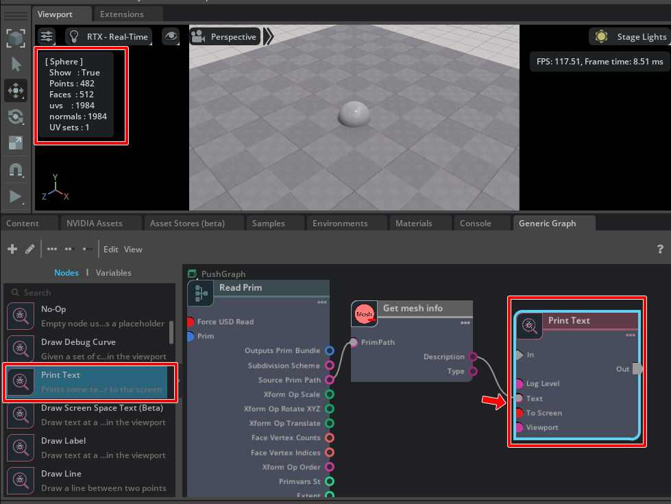

# Primを取得し、USDから情報を取得

"[ft_lab.OmniGraph.GetMeshInfo](../extensions/ft_lab.OmniGraph.GetMeshInfo)"はPrimを接続し、そのPrimパスからMesh情報を文字列(string)で返します。      

## GetMeshInfoを確認

GetMeshInfoノードの動きを確認します。    
Push Graphを使用しました。      

      

InputはPrimパスを指定します。      
Outputとして"Type"にはPrimの種類が文字列として入り、"Description"にはMeshの場合の情報をテキストで入ります。      

StageウィンドウでMeshを選択し、Graphにドロップします。     
      
Graphウィンドウでは、"Read Bundle"を選択します。      
      

このRead Bundleの"Source Prim Path"には、対象のPrimパスが入っています。     
これをGetMeshInfoノードの"PrimPath"に接続します。    
      

GetMeshInfoノードのPropertyで、Outputsの"Type"にPrimの種類として"Mesh"、"Description"にMeshの情報がテキストで入ることになります。     
      

"Description"の内容をDebug-Print Textノードの"Text"に接続しました。     
"Print Text"のPropertyで"To Screen"をOnにしています。     
      

以上により、Viewportの左上にMeshの内容(GetMeshInfoノードの"Description"の文字列)が表示されました。       

## [GetMeshInfo.ogn](../extensions/ft_lab.OmniGraph.GetMeshInfo/ft_lab/OmniGraph/GetMeshInfo/nodes/GetMeshInfo.ogn)

GetMeshInfoノードの実装を見ていきます。     
"GetMeshInfo.ogn"は以下のように記載しました。      

```json
{
    "GetMeshInfo": {
        "version": 1,
        "categories": "examples",
        "description": "Get mesh info",
        "language": "Python",
        "metadata": {
            "uiName": "Get mesh info"
        },
        "inputs": {
            "primPath": {
                "type": "token",
                "description": "Prim Path",
                "metadata": {
                    "uiName": "Prim Path"
                }
            }
        },
        "outputs": {
            "type": {
                "type": "string",
                "description": "Type",
                "metadata": {
                    "uiName": "Type"
                }
            },
            "description": {
                "type": "string",
                "description": "Description",
                "metadata": {
                    "uiName": "Description"
                }
            }
        }
    }
}
```
Outputsの"type"と"description"は両方ともstringが返されます。     
Inputsの"primPath"は"token"としました。     
これにより、Prim Pathを接続することができるようになります。     

```json
        "inputs": {
            "primPath": {
                "type": "token",
                "description": "Prim Path",
                "metadata": {
                    "uiName": "Prim Path"
                }
            }
        },
```

## [GetMeshInfo.py](../extensions/ft_lab.OmniGraph.GetMeshInfo/ft_lab/OmniGraph/GetMeshInfo/nodes/GetMeshInfo.py)

処理を行うcomputeは以下のように記載しました。     

```python
    @staticmethod
    def compute(db) -> bool:
        try:
            db.outputs.type = ""
            db.outputs.description = ""

            if db.inputs.primPath != None and db.inputs.primPath != "":
                # Get stage.
                stage = omni.usd.get_context().get_stage()

                # Get Prim and confirm presence.
                prim = stage.GetPrimAtPath(db.inputs.primPath)
                if prim.IsValid() == True:
                    db.outputs.type = prim.GetTypeName()

                    if db.outputs.type == 'Mesh':
                        db.outputs.description = GetMeshInfo.getMeshInfo(prim)

        except TypeError as error:
            db.log_error(f"Processing failed : {error}")
            return False

        return True
```

入力値の"db.inputs.primPath"は、Primパス("/World/Plane"など)が入っています。     
この値が入力されている場合、カレントのStageを取得しPrimを取得しています。     

```python
            if db.inputs.primPath != None and db.inputs.primPath != "":
                # Get stage.
                stage = omni.usd.get_context().get_stage()

                # Get Prim and confirm presence.
                prim = stage.GetPrimAtPath(db.inputs.primPath)
                if prim.IsValid() == True:
                    # 指定のPrimパスが存在する.

```

"db.outputs.type = prim.GetTypeName()"でOutputsの"type"にPrimの種類を文字列として格納しています。     
もしも、Primの種類がMeshの場合は"GetMeshInfo.getMeshInfo(prim)"で指定のPrimのMesh情報を取得して文字列として返し、"db.outputs.description"に文字列として格納しています。     

getMeshInfoはstaticとして以下のように記載しています。      
primよりMeshを取得し、その時の情報を文字列にして返しています。     

```python
    @staticmethod
    def getMeshInfo(prim):
        m = UsdGeom.Mesh(prim)

        # Get prim name.
        name = prim.GetName()

        # Get prim path.
        path = prim.GetPath().pathString

        # Get show/hide.
        showF = (m.ComputeVisibility() == 'inherited')

        # Get the number of faces of Mesh.
        facesCou = len(m.GetFaceVertexCountsAttr().Get())

        # Get number of normals.
        normalsCou = len(m.GetNormalsAttr().Get())

        # Total number of vertices.
        versCou = len(m.GetPointsAttr().Get())

        # Get UV.
        uvsCou = 0
        uvlayersCou = 0
        primvars = m.GetPrimvars()
        for primvar in primvars:
            typeName = str(primvar.GetTypeName().arrayType)
            if typeName == 'float2[]' or typeName == 'texCoord2f[]':
                # 'st'
                pName = primvar.GetPrimvarName()
                uvlayersCou += 1
                uvsCou = len(primvar.Get())

        # Get Material.
        rel = UsdShade.MaterialBindingAPI(prim).GetDirectBindingRel()
        pathList = rel.GetTargets()

        s = f"[ {name} ]\n"
        s += f"  Show   : {showF}\n"
        s += f"  Points : {versCou}\n"
        s += f"  Faces  : {facesCou}\n"
        s += f"  uvs    : {uvsCou}\n"
        s += f"  normals : {normalsCou}\n"
        s += f"  UV sets : {uvlayersCou}\n"

        return s
```

## [GetMeshInfoDatabase.py](../extensions/ft_lab.OmniGraph.GetMeshInfo/ft_lab/OmniGraph/GetMeshInfo/ogn/GetMeshInfoDatabase.py)

"GetMeshInfoDatabase.py"では、INTERFACEは以下のように指定しています。      

```python
    INTERFACE = og.Database._get_interface([
        ('inputs:primPath', 'token', 0, 'PrimPath', 'PrimPath', {}, True, None, False, ''),
        ('outputs:type', 'string', 0, 'Type', 'Array Type', {}, True, None, False, ''),
        ('outputs:description', 'string', 0, 'Description', 'Description', {}, True, None, False, ''),
    ])
```

'inputs:primPath'の種類は'token'としています(GetMeshInfo.ognでのtypeの指定と同じ)。      

Inputs/Outputs共に固定の型としてgetter/setterの記載を行っており、「[ft_lab.Omni.Graph.simpleNode](./SimpleNode.md)」の時と同じような記述になります。     
そのため、説明は省略します。      
