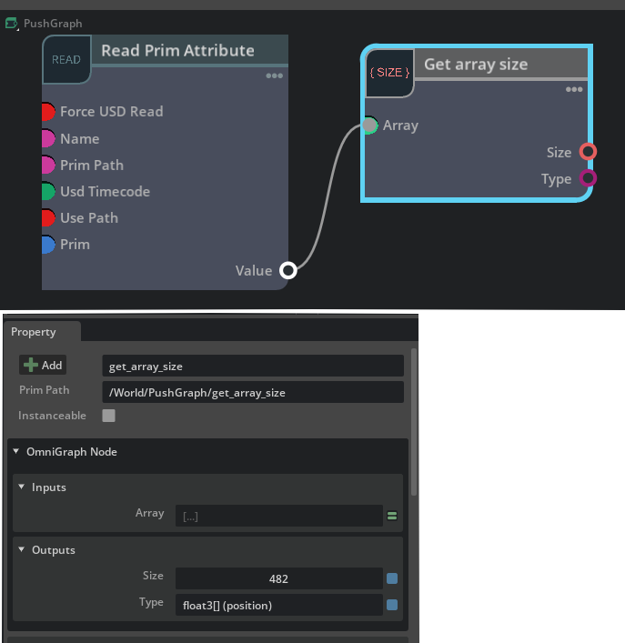

# ft_lab.OmniGraph.GetArraySize

"ft_lab.OmniGraph.GetArraySize" はinputにつないだ配列のサイズと種類を取得するサンプルです。     
     

[GetArraySize.ogn](ft_lab/OmniGraph/GetArraySize/nodes/GetArraySize.ogn)では以下のように配列を指定。      

```json
    "inputs": {
        "array": {
            "type": "arrays",
            "description": "Array",
            "metadata": {
                "uiName": "Array"
            }
        }
    },
```

"inputs.array"は接続するノードの種類は可変で指定できます。     

[GetArraySize.py](ft_lab/OmniGraph/GetArraySize/nodes/GetArraySize.py)では以下のように配列の種類とサイズを取得。      

```python
import numpy as np
import omni.graph.core as og
import omni.ext
import math

class GetArraySize:
    # ---------------------------------------------------.
    # Compute the outputs from the current input.
    # ---------------------------------------------------.
    @staticmethod
    def compute(db) -> bool:
        try:
            db.outputs.type = db.inputs.array.type.get_type_name()
            db.outputs.size = db.inputs.array.size

        except TypeError as error:
            db.log_error(f"Processing failed : {error}")
            return False

        return True
```

