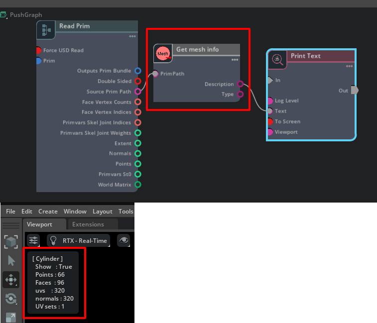

# ft_lab.OmniGraph.GetMeshInfo

"ft_lab.OmniGraph.GetMeshInfo" はinputにつないだPrimがメッシュの場合に      
メッシュ情報を取得するサンプルです。      
     
結果の文字列を"Print Text"に渡してViewportの左上に表示しています。     

[GetMeshInfo.ogn](ft_lab/OmniGraph/GetMeshInfo/nodes/GetMeshInfo.ogn)では以下のように指定。      
この"primPath"に文字列(token)としてPrimPathを接続します。     
```json
    "inputs": {
        "primPath": {
            "type": "token",
            "description": "Prim Path",
            "metadata": {
                "uiName": "Prim Path"
            }
        }
    },
```

[GetMeshInfo.py](ft_lab/OmniGraph/GetMeshInfo/nodes/GetMeshInfo.py)では以下のようにMesh情報を文字列として取得して、
"db.outputs.description"に格納しています。      

```python
from pxr import Usd, UsdGeom, UsdPhysics, UsdShade, Sdf, Gf, Tf
import numpy as np
import omni.graph.core as og
import omni.ext
import math

class GetMeshInfo:
    # ---------------------------------------------------.
    # Returns mesh information as a string.
    # ---------------------------------------------------.
    @staticmethod
    def getMeshInfo(prim):
        m = UsdGeom.Mesh(prim)

        # Get prim name.
        name = prim.GetName()

        # Get prim path.
        path = prim.GetPath().pathString

        # Get show/hide.
        showF = (m.ComputeVisibility() == 'inherited')

        # Get the number of faces of Mesh.
        facesCou = len(m.GetFaceVertexCountsAttr().Get())

        # Get number of normals.
        normalsCou = len(m.GetNormalsAttr().Get())

        # Total number of vertices.
        versCou = len(m.GetPointsAttr().Get())

        # Get UV.
        uvsCou = 0
        uvlayersCou = 0
        primvars = m.GetPrimvars()
        for primvar in primvars:
            typeName = str(primvar.GetTypeName().arrayType)
            if typeName == 'float2[]' or typeName == 'texCoord2f[]':
                # 'st'
                pName = primvar.GetPrimvarName()
                uvlayersCou += 1
                uvsCou = len(primvar.Get())

        # Get Material.
        rel = UsdShade.MaterialBindingAPI(prim).GetDirectBindingRel()
        pathList = rel.GetTargets()

        s = f"[ {name} ]\n"
        s += f"  Show   : {showF}\n"
        s += f"  Points : {versCou}\n"
        s += f"  Faces  : {facesCou}\n"
        s += f"  uvs    : {uvsCou}\n"
        s += f"  normals : {normalsCou}\n"
        s += f"  UV sets : {uvlayersCou}\n"

        return s

    # ---------------------------------------------------.
    # Compute the outputs from the current input.
    # ---------------------------------------------------.
    @staticmethod
    def compute(db) -> bool:
        try:
            db.outputs.type = ""
            db.outputs.description = ""

            # Get stage.
            stage = omni.usd.get_context().get_stage()

            # Get Prim and confirm presence.
            prim = stage.GetPrimAtPath(db.inputs.primPath)
            if prim.IsValid() == True:
                db.outputs.type = prim.GetTypeName()

                if db.outputs.type == 'Mesh':
                    db.outputs.description = GetMeshInfo.getMeshInfo(prim)


        except TypeError as error:
            db.log_error(f"Processing failed : {error}")
            return False

        return True
```

