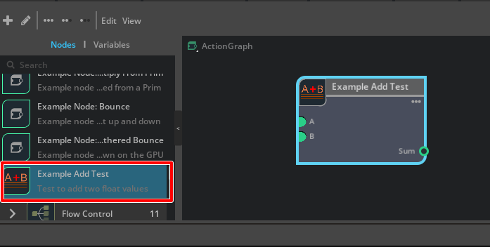
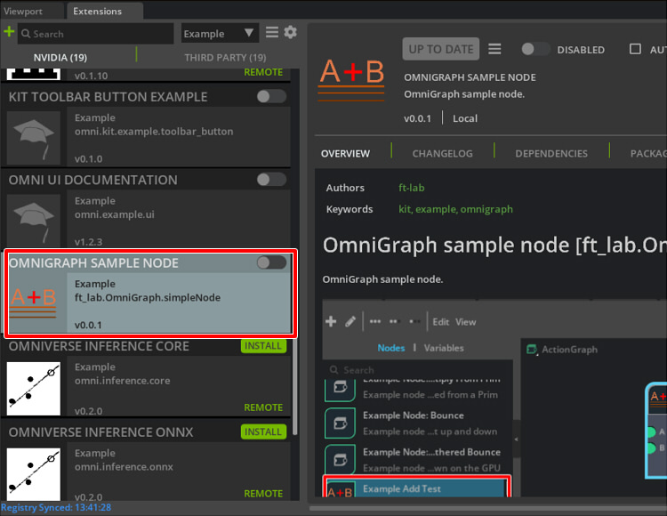
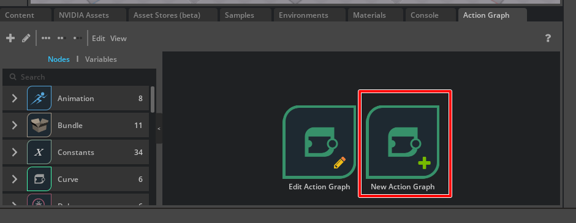
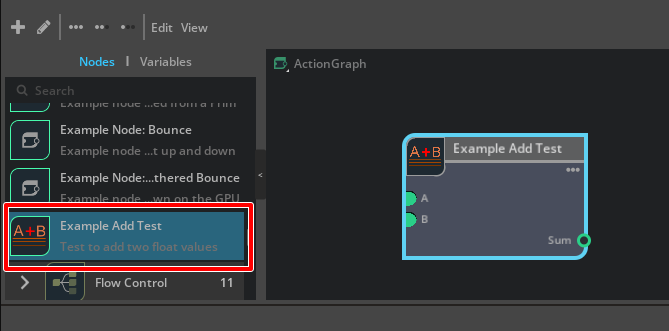
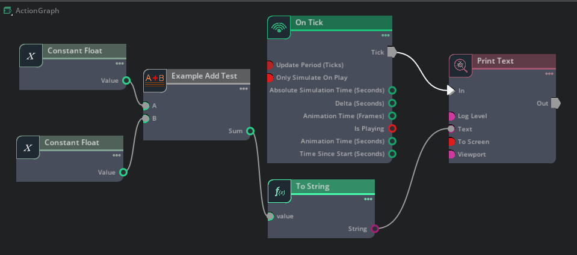

# ft_lab.OmniGraph.simpleNode

"ft_lab.OmniGraph.simpleNode" はExtensionを使ってOmniGraphのノードを作成する簡単なサンプルです。    
     

## Omni Graphの参考

* OmniGraph How-To Guide     
https://docs.omniverse.nvidia.com/kit/docs/omni.graph.docs/latest/howto/HowTo.html     

## Extensionの構成

"ft_lab.OmniGraph.simpleNode" Extensionの構成です。     
通常のExtensionと比べて、少し複雑になっています。     

```
[ft_lab.OmniGraph.simpleNode]
    [config]
        extension.toml

    [data]
        [icons]
            icon.svg  ... Node Icon.
        icon.png      ... Icon file (256 x 256 pixel).
        preview.png

    [docs]
        CHANGELOG.md
        index.rst
        README.md

    [ft_lab]
        [OmniGraph]
            [simpleNode]
                [nodes]
                    AddTest.ogn
                    AddTest.py
                [ogn]
                    __init__.py
                    AddTestDatabase.py
                __init__.py
                extension.py
```

## data/icon.png

アイコンファイル(256 x 256 pixel)。    
"config/extension.toml"から参照されます。    

## data/preview.png

ExtensionウィンドウのOVERVIEWで表示される画像です。      
"config/extension.toml"から参照されます。    

## docs

ドキュメント。     

|ファイル名|説明|     
|---|---|     
|index.rst|ドキュメントの構造を記載したファイル。|     
|README.md|OVERVIEWに表示される内容。|     
|CHANGELOG.md|CHANGELOGに表示される内容。|     

### index.rst

```
ft_lab.OmniGraph.simpleNode
###########################

.. toctree::
   :maxdepth: 1

   README
   CHANGELOG
```
## config/extension.toml

"extension.toml"はExtentionの設定を記載します。     

```
[package]
# Semantic Versionning is used: https://semver.org/
version = "0.0.1"

# Lists people or organizations that are considered the "authors" of the package.
authors = ["ft-lab"]

# The title and description fields are primarily for displaying extension info in UI
title = "OmniGraph sample node"
description="OmniGraph sample node."

# Path (relative to the root) or content of readme markdown file for UI.
readme  = "docs/README.md"

# URL of the extension source repository.
repository = ""

# One of categories for UI.
category = "Example"

# Keywords for the extension
keywords = ["kit", "example", "omnigraph"]

# Location of change log file in target (final) folder of extension, relative to the root. Can also be just a content
# of it instead of file path. More info on writing changelog: https://keepachangelog.com/en/1.0.0/
changelog="docs/CHANGELOG.md"

# Preview image and icon. Folder named "data" automatically goes in git lfs (see .gitattributes file).
# Preview image is shown in "Overview" of Extensions window. Screenshot of an extension might be a good preview image.
preview_image = "data/preview.png"

# Icon is shown in Extensions window, it is recommended to be square, of size 256x256.
icon = "data/icon.png"

# Watch the .ogn files for hot reloading (only works for Python files)
[fswatcher.patterns]
include = ["*.ogn", "*.py"]
exclude = ["*Database.py","*/ogn*"]

# We only depend on testing framework currently:
[dependencies]
"omni.graph" = {}
"omni.graph.nodes" = {}
"omni.graph.tools" = {}

# Main python module this extension provides.
[[python.module]]
name = "ft_lab.OmniGraph.simpleNode"
```

OmniGraphの場合は、通常のExtensionに以下を追加しています。      
```
# Watch the .ogn files for hot reloading (only works for Python files)
[fswatcher.patterns]
include = ["*.ogn", "*.py"]
exclude = ["*Database.py","*/ogn*"]

# We only depend on testing framework currently:
[dependencies]
"omni.graph" = {}
"omni.graph.nodes" = {}
"omni.graph.tools" = {}
```
参考 : https://docs.omniverse.nvidia.com/kit/docs/omni.graph.docs/latest/tutorials/extensionTutorial/extensionTutorial.html#config-extension-toml


## ft_lab.OmniGraph.simpleNode

"ft_lab.OmniGraph.simpleNode"内は、"ft_lab/OmniGraph/simpleNode"の階層でフォルダを構成します。     
```
[ft_lab]
    [OmniGraph]
        [simpleNode]
            [nodes]
                AddTest.ogn
                AddTest.py
            [ogn]
                __init__.py
                AddTestDatabase.py
            __init__.py
            extension.py
```

### [nodes]

nodes内の"AddTest.ogn"はノードの情報や構成、inputs/outputs情報を記載します。     
"AddTest.py"で、"AddTest.ogn"のinputs/outputs情報を使って処理する内容を記載します。      

### [ogn]

"\_\_init\_\_.py"は何も記載がないファイルです。     
"AddTestDatabase.py"は定型的な記載を行います。     
ほとんどは、テンプレート的にコピー&ペーストで問題なさそうです。     


### extension.py

Extensionの開始時と終了時に呼び出すメソッドを指定します。     
これは通常のExtensionと同じです。     

```python
import omni.ext
import importlib
import os
from .ogn import *

class SimpleNodeExtension(omni.ext.IExt):
    def on_startup(self, ext_id):
        print("[ft_lab.OmniGraph.simpleNode] startup")

    def on_shutdown(self):
        print("[ft_lab.OmniGraph.simpleNode] shutdown")
```

## Omniverse CreateにExtensionを入れる

Omniverse Createが"pkg/create-2022.3.3"にインストールされているとします。     
"ft_lab.OmniGraph.simpleNode"を"pkg/create-2022.3.3/exts"に入れます。     

Omniverse Createを起動したままでもExtensionを所定のフォルダに入れると、自動的にExtensionが認識されます。     

メインメニューの"Window"-"Extensions" を選択し、Extensionsウィンドウを表示します。     

Extensionのリストで"Python Extension Example"が存在するのを確認できました。     
    
右上のボタンをクリックしてこのExtensionを有効にします。     

## Action Graphを表示

メインメニューの[Window]-[Visual Scripting]-[Action Graph]を選択します。     

    
"New Action Graph"を選択。     

### Examples - Example Add Test

Examplesのカテゴリ内に、ここで作成した"Example Add Test"を確認できました。     
    

### 動作確認

以下のようにノードを組み合わせることで、2つのfloatを加算して出力する確認を行えます。     
    

加算した結果を"To String"で文字列に変換し、"Print Text"でスクリーンに結果を表示しています。     
Playを行うことで、加算結果がビューポートの左上に表示されます。     

