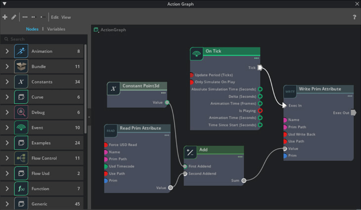

# OmniGraph

Omniverseで使用できるOmniGraphを学習するためのサンプルを貯めていく予定です。     
Omniverse Create 2022.3.3で確認。     

## OmniGraphとは？

Omniverse上での開発をノードの組み合わせで行います。       
OmniGraphはノードを組み合わせて制御（プログラム）を行うためのフレームワークです。     

参考 : https://docs.omniverse.nvidia.com/kit/docs/omni.graph.docs/latest/Overview.html

     

"Action Graph"を使用することで、あらかじめ用意されたノードを組み合わせることにより、ある程度の動きをOmniverse上で与えることができます。    
アニメーションやPhysicsの制御もOmniGraphで行うことができます。    

また、新しいノードをPythonでExtensionとして記載し、カスタマイズしていくことも可能です。     
また、Python上でWARPを使うことでGPUを使った並列処理を行うことができます。     

* [OmniGraphとAction Graphの違いは ?](./doc/OmniGraph_ActionGraph.md)
* [ノードの構成](./doc/NodeStructure.md)
* [Pythonでカスタムノードを作成](./doc/CustomNode_python.md)
* [Push GraphとAction Graphでのイベントの扱いの違い](./doc/PushActionGraph.md)

## Extension(Python)を使ったノード作成のサンプル

|Extension名|内容|   
|---|---|   
|[ft_lab.OmniGraph.simpleNode](extensions/ft_lab.OmniGraph.simpleNode)|2つのfloat値を加算して、float値を返す|   
|[ft_lab.OmniGraph.simpleNodeAny](extensions/ft_lab.OmniGraph.simpleNodeAny)|2つの任意の入力値を加算して、値を返す|   
|[ft_lab.OmniGraph.GetArraySize](extensions/ft_lab.OmniGraph.GetArraySize)|配列の種類とサイズを返す|   
|[ft_lab.OmniGraph.GetMeshInfo](extensions/ft_lab.OmniGraph.GetMeshInfo)|入力されたPrimパスがMeshの場合に、メッシュ情報を文字列として出力|   

## サンプルプロジェクト

* [仮想的なアナログ時計/デジタル時計に現在時刻を反映](https://github.com/ft-lab/Omniverse_OmniGraph_ClockSample)

----
